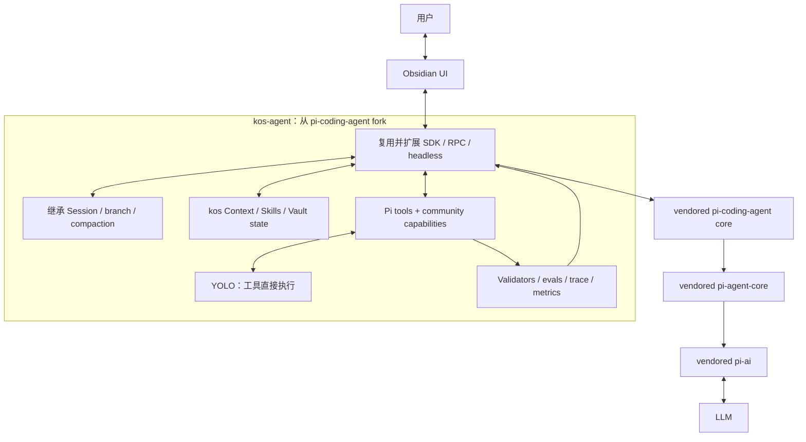

# kos-agent 总体架构

## 1. 概念结构



LLM 负责推理、选择和生成。Harness 负责它看见什么、能做什么、如何循环、状态如何保存、结果如何反馈以及用户如何观察和控制。

## 2. 源码策略

kos-agent 不是对 Pi API 的薄封装，也不是 clean-room sibling implementation。初始实现直接复制 Pi monorepo 中三个包：

```text
agent/
  packages/
    ai/              # 从 Pi packages/ai 复制，保留上游测试
    agent/           # 从 Pi packages/agent 复制，对应 pi-agent-core
    kos-agent/       # 从 Pi packages/coding-agent 复制后改造
  upstream/
    pi.json          # repo、tag/commit、导入日期和同步记录
    LICENSE.pi       # Pi MIT License 与 attribution
  docs/

agent/packages/kos-agent/src/
  core/              # 优先保留 session、tools、resources、extensions
  modes/rpc/         # 复用并扩展为 Obsidian headless 接口
  kos/               # Context、Vault contract、workflow 和 feedback patch
```

导入要求：

- 复制源码、测试、必要文档和许可证，而不是只复制编译产物。
- 首先让上游测试在本仓库通过，再做重命名和 kos 修改。
- kos 修改尽量集中在明确目录和 adapter，避免散拆成无法同步的重写。
- 每次同步记录上游 commit、冲突处理、行为变化和重新运行的测试。
- `pi-tui` 和 interactive TUI 不是 kos 产品入口；Obsidian 取代 TUI。初期如果构建仍有传递依赖，可以保留但不暴露为产品模式。

`ob-plugin/` 中的 Agent UI、`vault/` 中的规则和 Skill、`dev/` 中的 Eval 同样属于完整 Harness，只是由不同目录维护。

## 3. 继承与改造边界

默认继承：

- provider、模型目录、认证和流式协议。
- Agent loop、消息、队列、附件和事件。
- Session 持久化、resume、tree、fork、branch 和 compaction。
- Context files、Skills、prompt templates、extensions 和资源加载。
- `read`、`write`、`edit`、`bash`、`grep`、`find`、`ls` 等工具。
- SDK、RPC、JSONL、工具事件、usage 和错误处理。
- 与上述能力对应的上游测试。

kos 主要改造：

- Vault 根、对象规范、用户画像和看板状态的 Context。
- kos Skill 的发现规则、trace、Eval 和 Task Completion。
- YOLO 作为唯一执行策略。
- `ask_question`、Web 和 kos 工作流所需的扩展能力；不增加 MCP。
- Obsidian 对话、上下文引用、工具卡片、diff、inline edit 和 session UI。
- Validator、对象状态反馈、trace 和产品指标。

## 4. Agent 循环

```text
用户输入或系统事件
  -> Harness 选择并构造 context
  -> LLM 推理并输出文本或 tool call
  -> Harness 校验参数并立即执行 tool call
  -> Harness 把结果、错误和系统反馈返回 LLM
  -> LLM 继续或结束
  -> Harness 保存状态并向 UI 发出事件
```

kos-agent 直接继承 vendored `pi-agent-core` 和 `pi-coding-agent` 的通用循环，不重新实现。kos patch 只在确有产品差异的位置介入。

## 5. YOLO 工具循环

```text
LLM tool_call
  -> 参数 schema 校验
  -> 立即执行，不请求权限
  -> deterministic validation
  -> structured result + UI details
  -> 返回 LLM context
```

YOLO 是唯一模式。UI 展示工具名、输入摘要、进度、diff、结果和错误，但不在执行前弹 approval。Agent 可以自主修改对象状态；`ask_question` 是可选的人机协作工具，不是状态晋升的强制门禁。

## 6. Context 循环

Harness 根据任务动态组合：

- `.kos.md` 与系统级规则。
- 目标 Skill 和必要参考文件。
- 当前文件、选区、`@mention` 和 Obsidian 看板状态。
- 相关 Vault 对象与历史结果。
- 当前 session、Task Contract 和失败证据。
- 工具说明和当前运行环境。

默认不全量加载 Vault。上下文选择必须可追踪，Process Eval 应能判断关键规则或 Skill 是否真正进入 context。

## 7. Obsidian 产品协议

Obsidian 插件启动独立 kos-agent 子进程，通过扩展后的 coding-agent RPC 通信。首版至少支持以下产品命令：

- `handshake`
- `session.start`
- `session.resume`
- `session.new`
- `session.fork`
- `session.compact`
- `message.send`
- `message.steer`
- `message.follow_up`
- `run.abort`
- `question.answer`
- `context.attach`

首版至少需要以下事件：

- `agent.ready`
- `session.ready`
- `context.updated`
- `message.started`
- `message.delta`
- `message.completed`
- `skill.activated`
- `tool.started`
- `tool.updated`
- `tool.completed`
- `question.requested`
- `validation.completed`
- `run.settled`
- `error`

插件只依赖 kos-agent 固定的版本化出口。该出口从 vendored coding-agent RPC 类型演进，但不能要求插件跟随未冻结的上游内部字段变化。

## 8. 首个端到端验收场景

```text
用户在 Obsidian Agent view 发起对话
  -> 附加当前笔记或选区
  -> kos-agent 读取 Vault 并连续执行工具
  -> edit/write/bash 过程和 diff 在消息流中可见
  -> 相关 Validator 执行并把结果返回 Agent
  -> Agent 修正或完成
  -> Session 被持久化并可恢复
  -> Obsidian metadataCache/KosIndex 自动刷新看板
```

验收必须覆盖正常完成、用户 Stop、工具失败、Validator 失败后修正、插件重启后 resume。Agent 可在过程中直接更新状态，也可用 `ask_question` 提示用户审阅后再更新。

## 9. 状态与存储

| 数据 | 建议位置 |
|---|---|
| Markdown 对象与用户确认后的产物 | Vault |
| Harness 配置 | kos-agent 私有配置目录和 Vault 声明式配置 |
| 模型密钥 | 系统密钥链、环境变量或继承的 Pi 认证存储 |
| Session | 独立 kos-agent 子进程中继承并改造 coding-agent session storage |
| 原始 trace、缓存和临时网页正文 | kos-agent 私有缓存目录 |
| Task Contract 和用户 Eval 定义 | Vault |
| Framework Process Eval 和发布反馈 | `dev/` artifacts |
| 用户选择长期保存的对话总结 | 按 kos 模板写入 Vault |

## 10. 版本边界

| 组件 | 版本责任 |
|---|---|
| kos-agent Harness | 定义官方 Agent 行为和产品协议 |
| Obsidian 插件 | 声明支持的 kos-agent 协议范围 |
| Vault Contract | 定义对象、Skill 和语义确认契约版本 |
| vendored Pi packages | 记录上游 tag/commit、许可证和 kos patch |
| 社区能力 | 锁定版本，记录来源、许可证、安全评估和 adapter |
| LLM | 可替换，记录 provider/model/thinking 用于复现 |

协议不兼容时必须停止 Agent 连接，但看板和 Markdown 编辑仍应可用。

## 11. 故障与降级

- LLM 请求失败时保留 session 和已执行工具证据。
- vendored Pi 或 community capability 异常必须转换为明确 Harness 错误。
- Context 或 Validator 失败必须形成明确反馈，由 Agent 修正或向用户报告。
- MVP 中插件卸载或 Obsidian 退出时停止当前 run、持久化 session 并终止 kos-agent 子进程，不保留后台任务。
- Agent 首版只支持 Obsidian Desktop；移动端保留不依赖本地完整 Harness 的看板功能。
