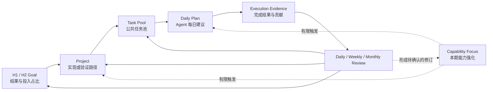

# H1/H2 目标驱动推进体系操作需求

> 状态：已实现并进入 runtime 数据合同
> 日期：2026-07-22  
> 范围：Vault 对象、kos-agent/Harness、Obsidian 看板、日报/周报/月报与能力强化  
> 裁决：本文是 H1/H2 目标推进功能的最新需求；与旧设计中的年度/月度 Goal、Task 单 Project 归属、Obsidian Bases 依赖冲突时，以本文为准。

## 1. 文档目的

本文定义用户从确立半年目标、创建项目、维护任务池、开始一天到周期复盘的完整操作，并明确每项操作应由 Vault、kos-agent/Harness 和 Obsidian 看板中的哪一层承担。

系统最终应回答五个问题：

1. 当前 H1 或 H2 最希望取得哪些结果，各自应投入多少精力。
2. 新 Project 对当前目标有多大支持，是否值得继续投入。
3. Project 是否具有至少一个量化指标，完成后产生了什么可验证成果。
4. 今天应从任务池选择哪些 Task，推迟或拒绝后如何继续管理。
5. 实际投入、项目结果和能力强化是否需要反向修正目标或推进方式。

## 2. 已确认的产品裁决

### 2.1 目标周期

- 系统只管理 `H1` 和 `H2` 半年目标，不增加年度 Goal 或月度 Goal。
- 同一半年可以存在多个 active Goal。
- active Goal 使用投入占比表达半年内期望的精力分配，占比之和必须为 `100`。
- 一个 active Goal 时占比为 `100`。
- Agent 可以建议调整占比，不能未经用户确认直接改变占比。

### 2.2 Project

- Project 是实现目标、验证想法或进行有限探索的一条路径。
- Project 可以支持一个或多个 Goal，也可以暂时不支持当前 Goal。
- Agent 创建或评审 Project 时必须判断目标支持度，并给出投入建议。
- 用户明确要求继续推进低支持度 Project 时，Agent尊重选择，不持续阻止执行；周报或月报应提示用户及时调整目标、占比或 Project 组合。
- 创建 Project 时应同时建议过程指标和结果指标；允许只有一种，但至少必须有一个量化指标。
- Project 完成与 Project 成功分开。验证失败但得到明确、可复用结论时，可以正常完成。

### 2.3 Task

- Task 是公共任务池中的独立实体，不归某一个 Project 所有。
- Task 可以关联零个、一个或多个 Project。
- 无 Project 的 Task 用于零散事务、维护事项和行政事项，不视为异常。
- Task 可以由 Agent 规划，也可以由用户随时创建。
- Agent 在“开始一天”时从任务池中生成少量建议，用户可以接受、调整、推迟或拒绝。
- 推迟不会产生新的 Task 状态；Task 保持 `todo`，并设置下次可推荐日期或复盘条件。
- Task 完成后，由 Agent 按参考标准判断它对每个关联 Project 的实际贡献，不能因为存在链接就自动增加相同进度。

### 2.4 能力强化

- 盖洛普等测评先进入 Personal Operating Profile，不在每次交互中携带完整报告。
- 用户为当前 H1/H2 选择一个或少量 Capability Focus，例如“总结能力”。
- Capability Focus 只在目标规划、Project 启动、开始一天、周报和月报等相关工作流中按需参与。
- 能力强化是次级建议，不能覆盖 Goal、硬截止、外部承诺、阻塞和用户明确选择。
- 每日建议默认最多让一个推荐项显式承担能力强化，避免所有回答围绕同一能力过拟合。

### 2.5 数据载体

- 不引入 Obsidian Bases 作为产品依赖。
- Goal、Project、Task、周期报告和用户确认结果以 Vault Markdown 为唯一长期事实源。
- 看板提供数据库式浏览、编辑、筛选和操作体验，用户不需要直接编辑复杂 frontmatter。
- 插件私有数据只保存可重建索引、布局、缓存、运行恢复和尚未确认的临时 UI 状态。
- 丢失插件私有数据后，不得丢失 Goal、Project、Task、推迟决定、指标或用户已确认的计划。

## 3. 总体模型



关系约束：

```text
Goal N..N Project
Project N..N Task
Task 0..N Project
Task Done 0..N Project Contribution Evidence
Goal / Project / Task N..N Review
```

## 4. Vault 需要支持的对象和操作

Vault 保存长期业务事实。所有结构化写入必须经过 kos-agent/Harness 的 Schema、状态和业务规则校验。

### 4.1 Goal 对象

建议路径：

```text
30_目标/YYYY-H1/<目标名>.md
30_目标/YYYY-H2/<目标名>.md
```

建议 frontmatter：

```yaml
type: goal
title: "形成多模态大模型研究与表达能力"
horizon: H1
period: 2027-H1
status: draft
allocation_weight: 40
health: unknown
period_start: 2027-01-01
period_end: 2027-06-30
created: 2026-12-20
updated: 2026-12-20
human_confirmed: false
tags: [goal]
```

正文至少包含：

```text
## 为什么重要
## 期望结果
## 量化指标
## 不做什么
## 约束与代价
## 关联项目
## 进展证据
## 风险与偏差
## 复盘记录
```

Vault 必须支持：

- 创建 Goal draft。
- 编辑名称、期望结果、指标、周期和不做什么。
- 设置或调整 `allocation_weight`。
- 激活、暂停、恢复、达成、放弃和归档 Goal。
- 记录 Goal 健康度：`unknown/on_track/at_risk/off_track`。
- 追加 Project 关系、结果证据和复盘记录。
- 记录 Goal 权重变更历史和用户确认信息。

确定性约束：

- 只有当前周期的 active Goal 参与权重合计。
- active Goal 的 `allocation_weight` 必须是大于 `0` 的数值。
- 当前周期所有 active Goal 权重之和必须为 `100`。
- draft 或 paused Goal 不参与合计。
- `draft -> active`、权重变化、`achieved/abandoned` 必须由用户确认。
- Goal 达成必须引用结果证据，不能根据 Task 完成数量自动判定。

### 4.2 Project 对象

Project 保留在：

```text
31_项目/
```

建议增加或调整的 frontmatter：

```yaml
type: project
title: "研究多模态大模型"
status: idea
category: research
priority: P1
primary_goal: "[[30_目标/2027-H1/形成多模态大模型研究与表达能力]]"
supporting_goals: []
goal_alignment: direct
alignment_reviewed: 2027-01-05
exploration_review_due: ""
current_stage: "建立知识框架"
next_milestone: "完成训练与对齐机制综述"
due: 2027-03-31
created: 2027-01-05
updated: 2027-01-05
tags: [project]
```

Project 正文必须包含：

```text
## 背景与策略假设
## 与当前目标的关系
## 过程指标
## 结果指标
## 当前阶段与下一里程碑
## 决策日志
## 进展证据
## 阻塞与风险
## 阶段性复盘
## 最终成果
## 最终结论与沉淀
```

目标支持度枚举：

| 值 | 含义 | 默认投入策略 |
|---|---|---|
| `direct` | 直接交付 Goal 指标或成果 | 正常进入高优先候选 |
| `enabling` | 提供必需能力、基础设施或关键决策 | 在需要时优先 |
| `exploratory` | 可能支持 Goal，但关系尚未验证 | 限定投入并设置复查日期 |
| `off_goal` | 没有清晰贡献路径 | 默认不主动推荐 |
| `conflicting` | 明显挤占当前 Goal 所需容量 | 提示业务取舍 |

Vault 必须支持：

- 从想法或材料创建 Project idea。
- 记录 primary Goal、supporting Goals、支持度、理由和复查日期。
- 创建、修改和删除过程指标、结果指标。
- 保证至少存在一个量化指标。
- 更新阶段、下一里程碑、进展、决策、阻塞、风险和证据。
- 激活、暂停、阻塞、恢复、完成、取消和归档 Project。
- 记录用户坚持推进低支持度 Project 的选择，避免 Agent 每天重复劝阻。
- Project 完成时分别记录“是否完成验证”和“是否取得预期成功”。

### 4.3 Project 指标

指标允许嵌套 YAML 或系统管理正文块，具体存储格式在 Schema 设计阶段裁决。无论采用哪种格式，必须提供稳定 ID：

```yaml
metrics:
  - id: weekly-research
    kind: process
    name: 每周完成专题研究次数
    unit: sessions
    baseline: 0
    target: 2
    current: 0
    updated: 2027-01-05
  - id: published-post
    kind: result
    name: 发布博客数量
    unit: posts
    baseline: 0
    target: 1
    current: 0
    updated: 2027-01-05
```

指标必须支持：

- 区分 `process` 和 `result`。
- 保存名称、单位、基线、目标值、当前值、更新时间和证据来源。
- 更新指标时追加证据，不只覆盖数值。
- 过程指标可以作为投入反馈，不能单独证明结果成功。
- 只有一个指标时允许创建 Project，但 Agent 必须说明缺少哪一类视角。

### 4.4 Task 对象

Task 统一位于：

```text
32_任务/
```

Project 正文 checkbox 只能作为临时草稿或 Task 引用，不参与独立状态和指标统计。

建议 frontmatter：

```yaml
type: task
title: "梳理视觉编码器的训练方法"
status: todo
projects:
  - "[[31_项目/大模型训练原理]]"
  - "[[31_项目/多模态大模型]]"
priority: P2
scheduled_for: ""
defer_until: ""
due: ""
estimate_minutes: 90
energy: high
work_mode: deep
growth_mode: neutral
created: 2027-01-06
completed: ""
tags: []
```

Task 状态：

```text
todo -> doing|blocked|done|cancelled
doing -> blocked|done|cancelled
blocked -> todo|doing|cancelled
done|cancelled 为终态
```

Vault 必须支持：

- 用户随时创建 Task。
- Agent 根据 Project 里程碑、复盘缺口或开始一天的结果创建 Task。
- 关联零个、一个或多个 Project。
- 编辑标题、优先级、预计投入、能量、工作模式、截止日和执行日期。
- 接受今日建议时写入 `scheduled_for` 或今日计划引用。
- 推迟时保留 `todo`，写入 `defer_until`。
- 退回任务池时清除 `scheduled_for`，保留 Task 和历史反馈。
- 开始、阻塞、解除阻塞、完成和取消 Task。
- 完成时记录实际结果、产物链接和对各 Project 的贡献证据。

确定性约束：

- `projects: []` 合法，不视为 orphan。
- `defer_until` 未到时不能进入自动每日推荐候选，但用户仍可手动选择。
- `done` 自动写入 `completed`。
- `blocked` 必须记录阻塞原因和下一次检查条件。
- 已完成或取消 Task 不再进入任务池和每日建议。

### 4.5 Capability Focus

Capability Focus 可以作为 Personal Operating Profile 中的当前周期管理块，或后续独立对象。MVP 优先复用 Profile，避免新增不必要对象。

至少记录：

```yaml
capability_focus:
  period: 2027-H1
  name: 总结能力
  behavior: 将复杂材料压缩为结构化结论
  applies_to: [project-kickoff, start-day, weekly-review, monthly-review]
  max_daily_recommendations: 1
  status: active
```

Vault 必须支持：

- 从盖洛普、复盘和用户判断中形成 draft。
- 用户确认本期强化能力、行为定义、适用场景和验证方式。
- 暂停、替换和结束 Capability Focus。
- 保存实践证据、反例和月度复盘，不自动改写 active 画像。

### 4.6 日报、周报和月报

建议落盘位置：

```text
40_日记/YYYY/MM/YYYY-MM-DD.md           # 日报
41_认知记录/周期复盘/YYYY-Www.md        # 周报
41_认知记录/周期复盘/YYYY-MM.md         # 月报
```

日报必须支持：

- 今日接受、完成、推迟、拒绝的 Task。
- 今日实际结果和 Project 贡献证据。
- 未完成原因和明日继续事项。
- 当前 Goal 投入提示，但不做短周期伪精确归因。

周报必须支持：

- 本周对各 Goal 的估算投入分布与目标占比偏差。
- 各 Project 的指标变化、里程碑、阻塞和停滞。
- 被持续推迟、反复拒绝或缺少下一步行动的 Task。
- off-goal/conflicting Project 的投入及目标调整提醒。
- Capability Focus 的实践证据与是否继续适用。

月报必须支持：

- Goal 健康度和关键结果证据。
- 计划投入占比与实际投入分布的趋势差异。
- 哪些 Project 有效、哪些策略假设被推翻。
- 需要继续、暂停、取消或新建的 Project。
- 是否建议修改 Goal、权重或 Capability Focus。

## 5. kos-agent 与 Harness 需要支持的操作

### 5.1 职责边界

Harness 负责确定性事实和约束：

- Schema、路径、状态和业务确认校验。
- Goal 权重合计、日期、到期、停滞和推迟过滤。
- Goal、Project、Task 的关系索引。
- 指标数值和证据引用的结构化更新。
- 构造 PlanningContext、Context fingerprint 和推荐运行 ID。
- 幂等写入、状态流转和报告 managed block。

LLM 负责语义判断：

- 协助用户梳理 H1/H2 Goal 和量化结果。
- 判断 Project 与 Goal 的因果支持关系。
- 建议 Project 的过程指标、结果指标和停止条件。
- 将里程碑拆成 Task，并识别跨 Project 可复用任务。
- 在合法候选中比较今天最值得推进的事项。
- 判断完成 Task 对各 Project 的 strong/supporting/incidental 贡献。
- 生成日报、周报、月报中的解释、判断和调整建议。

### 5.2 目标规划操作

Agent 必须支持：

- `plan_half_year_goals`：从用户输入、上期复盘和当前责任形成 H1/H2 Goal drafts。
- `create_goal`：创建 Goal draft。
- `update_goal`：更新目标描述、指标和非受保护字段。
- `set_goal_weights`：预览并提交一组 Goal 权重，原子校验合计为 100。
- `transition_goal`：激活、暂停、恢复、达成、放弃和归档。
- `review_goal_health`：根据结果证据生成健康度建议。

用户确认边界：

- Goal 激活、暂停、达成或放弃。
- active Goal 权重变化。
- Goal 结果定义和量化目标变化。
- Agent 建议调整 H1/H2 Goal 时必须说明依据和代价。

### 5.3 Project 操作

Agent 必须支持：

- `assess_project_alignment`：输出 Goal 关系、支持等级、原因、风险和投入建议。
- `create_project`：创建 Project idea，并至少建立一个量化指标。
- `update_project`：更新阶段、里程碑、指标、进展、证据和阻塞。
- `review_project_portfolio`：检查 Project 组合与 Goal 权重的偏差。
- `transition_project`：激活、暂停、阻塞、恢复、完成、取消和归档。
- `record_project_override`：记录用户坚持推进低支持度 Project 的选择和复查周期。

Project 支持度判断至少回答：

1. Project 是否直接改变某个 Goal 指标或交付物。
2. Project 是否提供 Goal 必需的能力、基础设施或决策。
3. 当前关联是否只是主题相近，还是存在可验证因果路径。
4. 延迟该 Project 对 Goal 有什么真实代价。
5. 它会占用哪些原本分配给其他 Goal 的容量。

### 5.4 Task Pool 操作

Agent/Harness 必须支持：

- `create_task`：用户或 Agent 创建 Task。
- `update_task`：修改 Task 属性和 Project 关系。
- `transition_task`：开始、阻塞、恢复、完成和取消。
- `list_task_pool`：返回可推荐、已推迟、已阻塞和今日已选 Task。
- `defer_task`：设置明确日期或下次复盘条件。
- `return_task_to_pool`：移除今日安排，不删除 Task。
- `complete_task`：记录结果并触发 Project 贡献评估。
- `assess_task_contributions`：分别判断对每个关联 Project 的贡献。

贡献判断参考标准：

| 级别 | 判断条件 | 写入行为 |
|---|---|---|
| `strong` | 直接满足指标、里程碑或关键交付物 | 更新指标或里程碑并追加证据 |
| `supporting` | 产物被复用、解除阻塞或减少关键不确定性 | 追加支持性进展证据 |
| `incidental` | 只有主题相近，Project 状态未发生变化 | 保留 Task 关系，不计入进展 |

### 5.5 开始一天

`start_day` 必须使用结构化 PlanningContext，至少包含：

```text
当前 H1/H2 Goal 及权重
Goal 最近实际投入偏差
active/blocked/exploratory/off-goal Project
开放、进行中、阻塞和到期 Task
未设置或已经到达 defer_until 的任务池候选
昨日未完成与用户反馈
今日可用时间、精力和硬约束
当前 Capability Focus 的适用摘要
Validator 异常
```

推荐硬约束顺序：

```text
安全或外部硬承诺
解除关键阻塞和依赖
逾期、今日到期和已 doing
Goal 权重与近期投入偏差
Project 里程碑和指标贡献
维护事项与零散 Task
相关时才考虑 Capability Focus
```

Agent 默认最多推荐三项：

1. 一个对当前 Goal 和 Project 最有价值的推进项。
2. 一个解除阻塞、履行承诺或维护系统的事项。
3. 一个可选的收尾、探索或能力强化事项。

不要求凑满三项。每项必须返回理由、关联 Goal、关联 Project、预计投入、取舍和 Capability Focus 使用情况。

### 5.6 推荐反馈

推荐状态与 Task 状态分离：

```text
recommended -> accepted|adjusted|deferred|rejected
```

Agent/Harness 必须支持：

- 接受现有 Task 并安排到今天。
- 接受 proposed Task 后创建正式 Task。
- 调整范围、预计投入、时间和 Project 关系。
- 推迟到指定日期或下次周/月复盘。
- 拒绝并记录原因。
- 相同 Context fingerprint 下恢复未完成的推荐交互。
- Context 变化后生成新版本，不覆盖已确认 Task 状态。

### 5.7 报告与复盘操作

Agent 必须支持：

- `end_day`：生成日报并写回实际结果、未完成原因和明日候选。
- `review_week`：生成周报，检查投入偏差、Project 健康和 Task 流动。
- `review_month`：生成月报，评估 Goal 健康、Project 策略和能力强化。
- `suggest_goal_revision`：根据持续偏差生成 Goal 或权重修改建议，等待用户确认。
- `suggest_profile_revision`：根据长期证据形成新的画像 draft，不修改 active Profile。

## 6. Obsidian 看板需要支持的操作

看板是 Goal、Project、Task 和周期复盘的主要用户界面，不依赖 Obsidian Bases。

### 6.1 目标区

展示：

- 当前 H1 或 H2 及周期剩余时间。
- active Goal、投入占比、健康度和最近证据。
- 权重合计与数据质量提示。
- 计划占比与最近实际投入估算的差异。
- 每个 Goal 的关联 Project 和无执行路径异常。

直接操作：

- 打开 Goal Markdown。
- 编辑 Goal 普通字段；active Goal 的结果定义变化必须显式确认。
- 调整多个 Goal 权重，并实时显示合计。
- 暂停、恢复或进入人工确认。
- 过滤当前、历史和 draft Goal。

Agent 操作：

- 梳理 H1/H2 目标。
- 建议量化指标和不做什么。
- 分析权重冲突和实际投入偏差。
- 生成目标复盘或修改建议。

### 6.2 Project 区

展示：

- Project 状态、阶段、下一里程碑和截止日。
- primary/supporting Goals、支持等级和最近评审时间。
- 过程指标、结果指标及最新值。
- 最近进展证据、阻塞、停滞和下一步 Task。
- 用户已确认继续推进的 off-goal Project。

直接操作：

- 新建 Project idea。
- 编辑指标目标值和当前值。
- 打开原 Markdown。
- 暂停、恢复、阻塞或提交状态确认。
- 查看关联 Task 和贡献证据。

Agent 操作：

- 分析 Project 与 Goal 的关系。
- 建议过程指标、结果指标和停止条件。
- 拆解里程碑并创建 Task。
- 分析阻塞、更新进展和进行阶段复盘。
- 检查低支持度 Project 的投入影响。

### 6.3 任务池区

展示：

- 可推荐 Task、进行中 Task、阻塞 Task、已推迟 Task。
- 关联的零个或多个 Project。
- 优先级、截止日、推迟日期、预计投入和能量要求。
- 最近被推荐、推迟或拒绝的反馈。

直接操作：

- 随时创建零散或 Project 相关 Task。
- 编辑 Task 和多 Project 关系。
- 手动加入今日计划。
- 推迟、退回任务池、开始、完成、阻塞或取消。
- 按日期、状态、Project 和推迟条件筛选。

Agent 操作：

- 从 Project 里程碑规划 Task。
- 识别可以同时服务多个 Project 的 Task。
- 拆分过大或完成定义不清的 Task。
- 分析阻塞和完成后的 Project 贡献。

### 6.4 今日区

展示必须明确分为三类：

- 确定性事实：到期、逾期、doing、blocked、defer 过滤和系统异常。
- Agent 建议：结构化推荐、生成时间、理由和来源。
- 用户计划：已经接受或调整的今日 Task。

操作：

- “开始一天”显式调用 Agent；打开、刷新和滚动不调用模型。
- 对每个建议执行接受、调整、推迟和拒绝。
- proposed Task 必须确认后才能创建正式 Task。
- 用户可以从任务池手动加入未被推荐的 Task。
- 已接受 Task 可以退回任务池。
- 完成 Task 后进入贡献确认或 Agent 贡献评估。
- “结束一天”生成日报，并保留用户补充入口。

只有看板收到真实结构化推荐结果后，才能显示“Agent 建议”。确定性排序不能因 Agent session 结束而改名为 Agent 建议。

### 6.5 审阅与复盘区

展示：

- 待确认的 Goal、权重和重大指标变化。
- Project 完成、取消、低支持度投入和方向调整。
- 持续推迟、拒绝或长期未执行的 Task。
- 日报、周报和月报入口及最近结论。
- Capability Focus 的实践证据和修订 draft。

操作：

- 生成、打开和补充日报、周报、月报。
- 接受或拒绝 Goal/Project/Profile 修改建议。
- 从报告结论创建 Project 或 Task。
- 将低支持度投入转化为 Goal 修改讨论。
- 查看推荐历史和主要拒绝原因。

### 6.6 看板编辑体验

- 用户通过表单、步进器、滑块、选择器和关系选择器操作结构化字段，不要求手写 YAML。
- Goal 权重使用可同时编辑的数字输入或滑块，并始终显示合计值。
- Project 指标使用可重复行编辑器，支持过程/结果类型切换和单位输入。
- Task 使用多选 Project 关系控件，并明确显示“零散任务”状态。
- 推迟操作提供日期、明天、下周、下次复盘等常用选项。
- 所有 Agent 建议显示依据；所有用户确认结果写回 Markdown。

## 7. 跨层操作矩阵

| 用户操作 | Vault | kos-agent/Harness | 看板 |
|---|---|---|---|
| 梳理 H1/H2 目标 | 保存 Goal draft | 访谈、提炼、生成指标 | 目标规划入口与确认 |
| 设置 Goal 占比 | 保存权重与历史 | 校验 active 合计为 100 | 多目标联动编辑 |
| 新建 Project | 保存 Project idea | 判断对齐、建议指标 | 创建表单和结果预览 |
| 坚持推进 off-goal Project | 保存 override 与复查时间 | 尊重执行并在周期复盘提示 | 显示偏差，不持续阻断 |
| 新建零散 Task | 保存 `projects: []` | 校验并加入任务池 | 快速创建 |
| 规划 Project Task | 保存多 Project Task | 拆解里程碑、识别复用 | 展示 proposed Task 并确认 |
| 开始一天 | 保存已确认计划 | 构造 Context、生成推荐 | 展示并收集反馈 |
| 推迟 Task | 保存 `defer_until` | 从候选中过滤并记录反馈 | 日期/复盘条件选择 |
| 退回任务池 | 清除今日安排 | 更新推荐状态 | 直接操作 |
| 完成 Task | 保存结果和完成日期 | 判断各 Project 贡献 | 完成与贡献确认 |
| 更新 Project 指标 | 保存数值与证据 | 校验和解释变化 | 指标编辑器 |
| 生成日报 | 保存 Diary | 总结当日事实和问题 | 结束一天入口 |
| 生成周报/月报 | 保存 Reflection/Report | 分析投入、结果和偏差 | Review 入口与确认 |
| 修改 Goal | 保存用户确认变更与结果证据 | 校验受保护字段、给出健康度建议 | 表单编辑、确认与 Agent 讨论 |

## 8. 实现状态

截至 2026-07-22，本需求定义的产品闭环已经落地：

- H1/H2 Goal、原子权重、健康度建议、结果定义人工确认和结果证据。
- Goal N:N Project、Task N:N Project，以及带稳定 ID 和证据的 Project 指标。
- 公共 Task Pool、推迟、退回、阻塞、完成结果和逐 Project 贡献。
- 确定性 PlanningContext、投入偏差、最多三项 DailyRecommendation 和四类反馈。
- off-goal override、周报/月报提醒，以及日报、周报和月报的持久化工作流。
- 按周期和工作流有限触发的 Capability Focus。
- 看板目标区、Project 编辑器、任务池、真实 Agent 推荐交互和 Agent 不可用时的 Vault 回退。
- Agent/RPC/插件合同测试、runtime Skill Eval、发布检查和真实 Obsidian E2E。

后续工作属于基于真实使用反馈的效果迭代，不再是合同缺口。重点观察推荐接受率、反复推迟原因、Goal 投入偏差和 Capability Focus 是否造成回答偏置；这些观察不得把插件私有状态升级为业务事实源。

## 9. 失败模式与约束

- 不把 Goal 权重机械转换为每日时间配额；以两到四周趋势观察偏差。
- 不用 Task 完成数量证明 Goal 或 Project 成功。
- 不因 Task 关联多个 Project 就为全部 Project 自动增加进度。
- 不把主题相近误判为实际贡献。
- 不因用户推进 off-goal Project 而每天重复劝阻。
- 不把 Capability Focus 变成所有回答的固定视角。
- 不把 Agent 建议写成用户已经接受的计划。
- 不把插件私有数据作为 Goal、Project、Task 或推迟决定的唯一来源。
- 不恢复 Project 正文 checkbox 与独立 Task 的双轨统计。
- 不引入年度/月度 Goal、Obsidian Bases 或企业级资源管理概念。

## 10. Eval 与验收

### 10.1 合同测试

- active Goal 权重合计恰好为 100。
- Goal 暂停、恢复和权重调整为原子操作。
- Project 至少有一个量化指标。
- Task 允许零个和多个 Project。
- `defer_until` 过滤与到期恢复正确。
- Task 完成不直接修改未确认的 Goal 状态。
- Markdown 是唯一长期事实源，插件缓存可以重建。

### 10.2 Agent Process Eval

- 创建 Project 前读取当前 Goal 和权重。
- 正确区分 direct、enabling、exploratory、off_goal 和 conflicting。
- 用户坚持推进 off-goal Project 后继续协助执行，并把提醒移到周/月复盘。
- 开始一天时不推荐尚未到 `defer_until` 的 Task。
- 推荐理由包含 Goal、Project、约束和取舍，不只输出优先级。
- Capability Focus 只在匹配场景中使用，每日最多影响一个默认推荐项。
- Task 完成后分别判断每个关联 Project 的贡献。
- Goal、权重和重大方向变化等待用户业务确认。

### 10.3 端到端场景

至少覆盖：

1. 三个 active H1 Goal 权重为 50/30/20，Agent 结合最近投入偏差推荐今日 Task。
2. 用户创建低支持度研究 Project，Agent 建议限定投入；用户坚持后正常推进并在周报提示目标调整。
3. 用户创建无 Project 的零散 Task，它可以进入任务池和今日建议。
4. 一个 Task 关联两个 Project，完成后对一个为 strong、另一个为 incidental。
5. 用户推迟 Task 到下周，期间不再推荐，到期后恢复候选。
6. Project 只有一个过程指标时可创建，但 Agent 明确提示缺少结果指标。
7. 验证型 Project 未达到预期结果，但形成明确反证后正常完成。
8. Capability Focus 为“总结能力”，只在相关任务和周期复盘中出现。
9. Agent 不可用时，看板仍可直接浏览、创建、编辑和流转 Goal/Project/Task。

## 11. 实施记录

### Phase 0：统一现有合同（已完成）

- 修复 Project 状态、Task 双轨和插件/Agent Schema 漂移。
- 明确 Markdown 唯一事实源和结构化操作边界。

### Phase 1：H1/H2 Goal 与 Project 指标（已完成）

- 增加 Goal 模板、Schema、状态机、权重操作和 Validator。
- 增加 Project Goal 关系、支持度和量化指标合同。
- 在看板增加目标区和 Project 指标编辑。

### Phase 2：公共 Task Pool（已完成）

- 将 Task 改为 `projects: []`。
- 增加 Task 创建、更新、推迟、退回任务池和多 Project 贡献操作。
- 迁移 Project checkbox 和原单 `project` 字段。

### Phase 3：PlanningContext 与每日推荐（已完成）

- 实现半年目标、权重、投入偏差、Project 组合和 Task Pool Context。
- 实现结构化推荐及接受、调整、推迟、拒绝闭环。
- 看板区分确定性事实、Agent 建议和用户计划。

### Phase 4：日报、周报和月报（已完成）

- 扩展日终结果与贡献记录。
- 增加周报、月报和 Goal/Project 调整建议。
- 将 off-goal 提醒从每日执行迁移到合适的周期复盘。

### Phase 5：Capability Focus 与效果 Eval（已完成）

- 接入 H1/H2 Capability Focus 选择器和有限触发规则。
- 增加投入偏差、推荐反馈和能力强化场景 Eval。
- 根据真实使用结果调整 Agent 的参考标准，不引入黑盒总分。

## 12. 相关文档与真相源

- `vault/90_系统/规则/对象规范.md`
- `vault/90_系统/文档/20_对象模型与模板.md`
- `vault/90_系统/文档/23_项目与任务.md`
- `vault/80_Skills/core/kos-kickoff/SKILL.md`
- `vault/80_Skills/core/kos-create-project/SKILL.md`
- `vault/80_Skills/core/kos-update-project/SKILL.md`
- `vault/80_Skills/core/kos-start-my-day/SKILL.md`
- `vault/80_Skills/core/kos-end-my-day/SKILL.md`
- `agent/docs/02_总体架构.md`
- `ob-plugin/docs/01_功能规格.md`
- `ob-plugin/docs/03_指标定义.md`
- `ob-plugin/docs/04_看板产品与交互设计需求.md`
- `dev/docs/目标驱动的个人推进体系设计.md`
- `dev/docs/个性化协作与每日推荐优化.md`

本文的实施结果已同步进入 Vault 规范与模板、kos-agent Schema/operation/RPC、插件模型与交互、runtime 用户文档和对应 Eval。后续修改仍须跨层同步，并在下游同步或发布前运行 `make release-check`。
