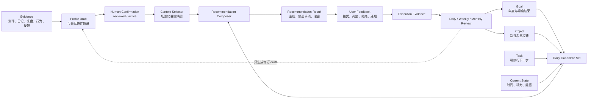

# 个性化协作与每日推荐优化

> 状态：现状基线与目标方案，待产品与技术方案评审  
> 基线日期：2026-07-21  
> 外部方案调研日期：2026-07-22  
> 范围：个人测评输入、Personal Operating Profile、kos-agent Context、每日事项建议和 Obsidian 交互

年度/月度目标、Project、Task、个人画像与 Agent 规划闭环的总体方案见 `dev/docs/目标驱动的个人推进体系设计.md`。本文聚焦个性化子系统，记录当前实现基线、外部方案调研、Context 与推荐闭环的目标架构、实施阶段和效果评估边界。

## 1. 背景与目标

kos 曾计划支持一条长期个性化协作链路：用户提供盖洛普、MBTI、荣格、Big Five 等测评结果，Agent 再结合 Vault 中的目标、项目、任务、日记、复盘和真实行为，维护可修正的个人操作画像，并据此推荐每日值得推进的事项和协作方式。

目标不是根据人格标签自动替用户做决定，而是把多种证据整理成当前阶段可验证的协作假设，使每日建议同时回答：

- 当前目标和项目状态要求做什么。
- 用户当前的能力优势、能量模式和协作偏好支持怎样推进。
- 哪些建议来自确定性事实，哪些来自仍可被推翻的画像假设。
- 用户接受、拒绝或调整建议后，系统应如何修正后续判断。

理想链路为：

```text
测评报告、日记、复盘、项目行为和用户反馈
-> 形成 personal_operating_profile draft
-> 用户审阅并确认 reviewed / active
-> 每日工作流读取目标、项目、任务、近期状态和 active 画像
-> Agent 生成带依据的今日主线和候选事项
-> 用户确认、调整或拒绝
-> 执行结果和反馈进入后续画像验证
```

## 2. 非目标与安全边界

- 不把 MBTI、盖洛普或任何单一测评当成人格真相。
- 不进行心理诊断、职业诊断或能力定级。
- 不让画像默认污染所有 Agent 输出；只有明确适用的工作流才能读取。
- 不让 Agent 自行把画像晋升为 `reviewed`、`active`、`verified` 或 `mature`。
- 不替用户确认今日主线、修改长期目标或隐藏推荐依据。
- 不以通用 framework 收集或分发用户的私人测评和画像内容。

个人画像内容继续只存在于个人 Vault 的 `42_个人操作画像/`，framework 同步只能补目录和通用能力，不能覆盖个人内容。

## 3. 当前完成度结论

截至基线日期，个人画像的对象基础、创建 Skill、Validator 和人工审阅已经存在；普通的每日工作台与“开始一天”入口也已经存在。但两者尚未形成稳定的自动闭环。

如果只评价“个人操作画像基础设施”，当前约完成 **70%**。如果按“上传测评后，长期维护画像并自动驱动每日个性化推荐”的完整产品目标评价，当前约完成 **40%**。

| 环节 | 当前完成度 | 结论 |
|---|---:|---|
| 画像对象模型与生命周期 | 85% | 已具备目录、模板、Schema、状态和人工确认规则 |
| 测评结果整理为画像 | 65% | 已有 core Skill，但依赖对话式输入和 Agent 判断 |
| 上传与首次引导 | 35% | 可附加 Vault 图片、Markdown 和选区，无专用报告导入流程 |
| 插件索引与人工审阅 | 70% | 能识别 draft 画像并进入待审核中心，无专用画像管理界面 |
| Agent Context 接入 | 20% | 可按用户指令读取，尚未按工作流自动选择 active 画像 |
| 每日个性化推荐 | 25% | 有普通今日建议和触发入口，尚未消费画像字段 |
| 反馈、指标与 Eval | 10% | 只有结构和通用工作流测试，没有个性化闭环评估 |

这些百分比只用于表达相对成熟度，不是发布门禁，也不是效果评估结果。

## 4. 已实现能力

### 4.1 Personal Operating Profile 对象

Runtime 已定义 `personal_operating_profile`：

- 默认路径为 `42_个人操作画像/`。
- 新建状态为 `status: draft`、`confidence: draft`、`reviewed: false`。
- 状态流转为 `draft -> reviewed -> active -> archived`。
- 测评、日记、复盘、项目行为、Agent 交互观察和他人反馈只能作为证据。
- 正文要求区分当前结论、支持证据、适用与不适用场景、仍需验证假设和已推翻判断。
- 进入人工确认状态时必须具有 `human_confirmed` 或同类确认元数据。

唯一真相源仍是：

- `vault/90_系统/规则/对象规范.md`
- `vault/90_系统/模板/PersonalOperatingProfile_个人操作画像模板.md`
- `agent/packages/kos-agent/src/kos/validation/schemas/personal_operating_profile.schema.yaml`

### 4.2 画像创建与更新 Skill

`vault/80_Skills/core/kos-update-personal-profile/SKILL.md` 已明确支持盖洛普、荣格、MBTI 和 Big Five 等测评结果，也允许结合长期日记、复盘和项目行为。

Skill 当前能够：

1. 区分测评、自我反思、真实行为、Agent 观察和他人反馈。
2. 把结论写成可验证、可推翻的协作假设。
3. 调用 `kos-harness create --kind personal_operating_profile` 创建 draft。
4. 运行 Validator 并返回仍需用户确认的内容。

当前推荐的手工路径为：

```text
把测评截图或整理后的 Markdown 放入 Vault
-> 在 Agent 侧栏附加图片、笔记或选区
-> /kos-update-personal-profile
-> Agent 创建画像 draft
-> 用户在原文件或待审核中心审阅
-> 用户确认后进入 reviewed / active
```

### 4.3 kos-agent 确定性能力

kos-agent 已实现：

- 画像模板渲染与创建。
- 路径和 frontmatter Schema 校验。
- 画像状态机与人工确认约束。
- 通过 RPC 执行通用对象操作和 Validator。

Pi 的 Context files 和 Skill 发现也已经进入 kos-agent。当前产品 Context 会加载 `.kos.md`，Agent 可以再通过通用文件工具读取相关画像，但不存在“启动每日工作流时自动选取 active 画像”的专用 Context 构造器。

### 4.4 Obsidian 插件能力

插件当前能够：

- 索引并解析 `personal_operating_profile`。
- 将 draft 画像计入待审核中心。
- 按状态机执行带人工确认的晋升。
- 在 Agent 对话中附加当前 Markdown、选区、Vault Markdown 引用、目录清单和 Vault 内图片。
- 从看板点击“开始一天”，触发 `/kos-start-my-day` Agent 工作流。

图片附件当前只支持 Vault 内的 PNG、JPEG、GIF 和 WebP，单张上限 10 MB。没有任意本地文件选择器，也不能把 PDF、Word 或测评平台导出文件直接作为结构化测评输入。

### 4.5 普通每日工作流

`kos-start-my-day` 与确定性的 `daily-dashboard` 已能聚合：

- active、idea、blocked 和 paused 项目。
- todo、doing 和 blocked 任务。
- 待处理输入与收件箱。
- 待审核对象。
- 当日或高重要性 Signal。

看板也能展示到期、受阻、停滞、积压和待审核状态，并把“开始一天”转换成 Agent 命令。这已经构成普通每日规划的基础，但不是画像驱动的个性化推荐。

## 5. 当前关键断层

### 5.1 输入不是测评导入流程

现有图片和 Markdown 附件只解决“模型看得到内容”，没有解决：

- 报告类型识别和版本记录。
- PDF、Word、表格或网页报告导入。
- 维度、分数、排名、原始解释和来源页码的结构化提取。
- 重复上传、报告更新和不同测评之间的冲突处理。
- 从测评证据到画像假设的可追溯映射。

因此当前效果高度依赖用户如何提问、模型视觉能力和报告排版。

### 5.2 画像尚未进入每日 Context

二期看板设计要求每日工作流至少获得“当前有效的个人操作画像”，但当前实现没有完成这条数据链路：

- `/kos-start-my-day` 的前置读取清单没有个人操作画像。
- `daily-dashboard` 不扫描 `personal_operating_profile`。
- 看板传给 Agent 的结构化上下文只包含模块、意图、选中对象和活动文件。
- kos-agent 的启动 Context 自动加载 `.kos.md`，不自动加载 active 画像。

用户仍可明确要求 Agent 读取画像，但这属于手工用法，不能保证每日建议稳定使用正确版本。

### 5.3 每日建议仍是通用排序

当前确定性工作台把 active 项目列为“今日主线候选”，任务排序主要依据状态、到期日和优先级。它没有使用：

- 项目目标与长期目标的贡献关系。
- 画像中的高能量任务和低能量任务。
- 当前精力与日记趋势。
- 协作偏好、决策盲区和不适用场景。
- 近期接受、拒绝或未完成建议的反馈。

`daily-workflows.ts` 中的 AI 建议仍是“处理待审核”或“选择一个明确的下一步行动”等通用提示。

### 5.4 看板没有承载真实 Agent 推荐结果

“开始一天”会打开 Agent 侧栏并运行 Skill，但看板中的今日主线卡片仍由确定性任务列表生成。当前的 `AGENT 建议 · HH:mm` 只表示 Agent 运行已经结束，不表示这些卡片来自某个已持久化的 Agent 推荐结果。

尚未定义：

- 推荐结果的结构化协议。
- 推荐项与 Project、Task、Source、Review 的稳定关联。
- 推荐理由、所用画像版本和证据来源。
- 接受、调整、拒绝、稍后处理等用户动作。
- 同一天重复运行时的替换、合并和历史保留规则。

### 5.5 画像更新和推荐反馈没有闭环

当前画像主要由用户主动触发更新。系统不会因为以下信号自动形成待审查的更新建议：

- 某类任务长期高完成或长期拖延。
- 用户持续拒绝某类推荐理由。
- 日记中的精力模式与画像假设矛盾。
- 项目行为推翻旧的优势或盲区判断。

即使未来加入反馈，也只能生成新的 draft 或修订建议，不能自动改写 active 画像。

### 5.6 缺少效果 Eval 与指标

现有测试覆盖对象解析、状态流转、Validator、通用每日工作台和插件基础交互。尚无端到端 Eval 验证：

```text
给定测评报告和行为证据
-> 是否生成有证据边界的画像 draft
-> 人工确认 active 后
-> 每日工作流是否读取正确画像
-> 推荐是否同时符合目标、状态和适用场景
-> 用户反馈是否能形成可审查的后续修正
```

现有 `ob-plugin/docs/03_指标定义.md` 只将 draft 画像纳入待审核计数，没有定义推荐接受率、调整率、完成率、解释采用率或画像假设验证率。是否需要这些指标、如何避免用虚假代理指标优化推荐，仍需单独评审。

## 6. 当前真实可用范围

现在可以稳定宣称的能力是：

```text
用户通过对话提供测评或行为证据
-> Agent 使用专用 Skill 创建个人操作画像 draft
-> 系统校验结构和权限
-> 用户人工审阅并激活
-> 用户在具体任务中明确要求 Agent 参考画像
```

现在不能稳定宣称的能力是：

```text
上传任意测评报告
-> 系统自动维护长期画像
-> 每天自动结合能力潜力、目标和实时状态
-> 在看板生成可追踪、可反馈的个性化事项推荐
```

## 7. 外部方案调研

本节用于识别已经被其他 Agent 产品验证过的机制，以及它们尚未解决的问题。调研对象为：

- OpenClaw：`openclaw/openclaw`，源码基线 `edecdbd05efc98c4f580309ac89e8459462f00c9`。
- Hermes Agent：`NousResearch/hermes-agent`，源码基线 `d8bf3df255beccef4b55b85996884525e2ec28e3`。

调研只把官方仓库文档和实现代码视为已验证依据。README 宣传、预留枚举、测试夹具或只有接口没有生产调用方的代码，不视为完整实现。

### 7.1 OpenClaw

OpenClaw 默认使用文件化的分层记忆：

```text
USER.md                  用户身份、称呼和偏好
MEMORY.md                经整理的长期事实、偏好和决定
memory/YYYY-MM-DD.md     近期观察、会话摘要和详细工作记忆
```

其关键机制为：

1. `USER.md` 作为稳定用户资料进入工作区 Context；包含私人长期记忆的 `MEMORY.md` 只允许进入主私聊，不进入群聊。
2. 详细日记不在每次请求中完整注入，而是由 `memory_search`、`memory_get` 按需读取。
3. Heartbeat 负责周期检查和记忆整理，Cron 负责精确提醒和定时工作。
4. 可选 Honcho 插件观察每轮对话并自动维护用户模型；可选 LanceDB 插件支持自动召回、触发式捕获和显式遗忘。
5. 曾经存在的 inferred commitments 已停止，不再从普通对话自动提取和派发未来承诺，精确行动改用显式定时任务。

OpenClaw 的优势是 Context 分层、私密范围隔离、主动唤醒和记忆检索已经形成完整 Harness。它的限制是 `USER.md` 与 `MEMORY.md` 主要是自由文本，没有测评证据模型、画像生命周期、年度/月度目标模型，也没有画像驱动的每日任务选择协议。

主要依据：

- [Memory overview](https://github.com/openclaw/openclaw/blob/edecdbd05efc98c4f580309ac89e8459462f00c9/docs/concepts/memory.md)
- [System prompt bootstrap injection](https://github.com/openclaw/openclaw/blob/edecdbd05efc98c4f580309ac89e8459462f00c9/docs/concepts/system-prompt.md#workspace-bootstrap-injection)
- [Default AGENTS memory and heartbeat rules](https://github.com/openclaw/openclaw/blob/edecdbd05efc98c4f580309ac89e8459462f00c9/docs/reference/templates/AGENTS.md)
- [Honcho memory](https://github.com/openclaw/openclaw/blob/edecdbd05efc98c4f580309ac89e8459462f00c9/docs/concepts/memory-honcho.md)
- [Memory LanceDB](https://github.com/openclaw/openclaw/blob/edecdbd05efc98c4f580309ac89e8459462f00c9/docs/plugins/memory-lancedb.md)

### 7.2 Hermes Agent

Hermes 把内置个性化拆成两个有明确容量限制的存储：

```text
USER.md      用户角色、偏好、沟通方式和工作习惯，默认 1375 字符
MEMORY.md    环境、项目约定、工具经验和 Agent 学习，默认 2200 字符
```

两份内容在会话开始时形成冻结快照并注入系统提示词。会话中写入立即落盘，但通常到新会话或 Context 压缩后才进入新的系统提示词快照。

Hermes 的关键机制为：

1. memory tool 明确要求在出现偏好、纠正、个人信息和稳定工作方式时主动保存。
2. 默认每 10 个用户轮次触发一次后台 memory review，重新检查用户偏好和协作期待。
3. 后台 skill review 区分“用户是谁”和“怎样为这个用户执行某类任务”：通用偏好进入 USER，任务类别中的格式、语气和工作流纠正进入对应 Skill。
4. `memory.write_approval` 可把前台和后台写入都放入待审批队列，由用户批准、拒绝或关闭记忆。
5. `/suggestions` 可提供每日简报、周复盘、工作日启动提醒等 Cron 候选，用户接受后才真正创建定时任务。

Hermes 比 OpenClaw 默认方案更积极地学习偏好，也更重视把协作纠正沉淀到 Skill。但它仍存在关键断层：官方 daily briefing 文档明确说明 Cron 在新会话运行，不自动获得对话记忆，个性化信息需要直接写进 Cron prompt。这意味着用户画像和每日主动建议没有形成稳定的数据合同。

`cron/suggestions.py` 声明了 `catalog`、`blueprint`、`usage` 和 `integration` 四类来源，但当前生产调用中只确认 catalog 与 blueprint 已接通；usage 和 integration 不能仅因枚举与测试存在就视为已经完整实现。

主要依据：

- [Persistent Memory](https://github.com/NousResearch/hermes-agent/blob/d8bf3df255beccef4b55b85996884525e2ec28e3/website/docs/user-guide/features/memory.md)
- [Memory tool implementation](https://github.com/NousResearch/hermes-agent/blob/d8bf3df255beccef4b55b85996884525e2ec28e3/tools/memory_tool.py)
- [System prompt memory injection](https://github.com/NousResearch/hermes-agent/blob/d8bf3df255beccef4b55b85996884525e2ec28e3/agent/system_prompt.py)
- [Background memory and skill review](https://github.com/NousResearch/hermes-agent/blob/d8bf3df255beccef4b55b85996884525e2ec28e3/agent/background_review.py)
- [Cron suggestions](https://github.com/NousResearch/hermes-agent/blob/d8bf3df255beccef4b55b85996884525e2ec28e3/cron/suggestions.py)
- [Daily briefing personalization boundary](https://github.com/NousResearch/hermes-agent/blob/d8bf3df255beccef4b55b85996884525e2ec28e3/website/docs/guides/daily-briefing-bot.md#adding-personal-context-with-memory)

### 7.3 横向结论

| 维度 | OpenClaw | Hermes Agent | kos 当前状态 |
|---|---|---|---|
| 用户画像 | `USER.md` 自由文本 | 独立且有容量限制的 `USER.md` | 结构化 `personal_operating_profile` |
| 长期记忆 | `MEMORY.md` + 每日记忆 | `MEMORY.md` + 会话搜索 | 日记、复盘、画像和项目行为均在 Vault |
| 自动学习 | 默认依靠 Agent 写文件，插件可增强 | 周期后台回顾并主动捕获偏好 | 主要由用户主动触发 Skill |
| Context | 分层注入、详细记忆按需检索 | 画像冻结快照默认进入新会话 | active 画像尚未进入每日工作流 |
| 用户控制 | 文件可编辑，插件支持遗忘 | 可开启写入审批和待处理队列 | 画像晋升强制人工确认 |
| 主动工作 | Heartbeat + Cron | Cron + 建议式自动化 | 有开始一天入口，无画像消费 |
| 目标和项目 | 无统一个人推进模型 | 无统一个人推进模型 | Project/Task 已有，Goal 为设计提案 |
| 测评证据 | 无专用模型 | 无专用模型 | 已支持作为画像证据 |
| 效果评估 | 侧重召回和运行正确性 | 侧重捕获和运行正确性 | 个性化效果 Eval 尚未实现 |

两个项目验证了“记忆、Context、主动唤醒、用户控制”必须进入 Agent Harness，而不能只靠一个 Prompt。但它们都没有实现从心理测评和真实行为证据出发，结合长期目标选择每日行动并用结果修正画像的完整闭环。

## 8. kos 的方案裁决

### 8.1 应采纳的机制

1. **分层 Context**：借鉴 OpenClaw，把稳定画像摘要、近期行为证据和详细历史分层；详细历史只在需要时检索，不把整个画像目录注入每一轮。
2. **画像与 Skill 分离**：借鉴 Hermes，画像保存“当前对用户的协作假设”，Skill 保存“执行某类任务时应采用的流程”。格式、语气和任务拆解偏好可以影响 Skill 运行，但不能静默改写 framework Skill 文件。
3. **后台回顾只产出建议**：周期回顾可以发现画像与行为的矛盾，生成待审查修订 draft；不能直接修改 active 画像。
4. **建议式自动化**：Agent 可以建议启用每日规划、周复盘或专项提醒，但只有用户接受后才建立持续运行机制。
5. **显式遗忘与归档**：被推翻的判断必须能归档、替换和停止参与 Context，不能只在文件末尾追加新结论。
6. **私密范围隔离**：个人画像只进入单用户、明确适用的 kos 工作流；群聊、共享会话和无关 Skill 默认不得读取。

### 8.2 不应照搬的机制

1. 不把自由文本 `USER.md` 作为唯一画像真相源。kos 继续保留证据、适用场景、反证和人工确认生命周期。
2. 不把整个 active 画像注入所有 Agent 会话。Context 必须由工作流、场景和 `applies_to_skills` 选择。
3. 不允许后台 Agent 直接更新正式画像或通用 core Skill。自动学习只能形成候选修订。
4. 不把个人画像复制进 Cron prompt。定时或每日工作流应在运行时按稳定引用读取当前版本，否则画像更新后会产生不可见的陈旧副本。
5. 不根据使用频率自动建立定时任务。重复行为只能触发建议，不能替用户形成长期承诺。
6. 不把 MBTI、盖洛普或单次行为自动转成能力结论。测评是低到中置信度证据，不是行动排序权重本身。

### 8.3 kos 的差异化方向

kos 不应与通用 Agent 比“记住更多用户偏好”，而应形成以下差异：

```text
可追溯的画像证据
+ 有人工确认的协作假设
+ 年度/月度目标和 Project/Task 事实
+ 可解释的每日推荐
+ 执行结果与反证
= 面向个人进步的推进闭环
```

其中画像只调整“怎样推进”，Goal 决定“为什么推进”，Project 决定“通过什么路径推进”，Task 决定“下一步做什么”。

## 9. 目标架构



### 9.1 六个责任层

| 层 | 输入 | 责任 | 不负责 |
|---|---|---|---|
| Evidence | 测评、日记、项目行为、反馈 | 保存来源、日期和证据类型 | 直接决定画像结论 |
| Profile | 证据与人工判断 | 保存可验证协作假设及适用边界 | 决定人生目标 |
| Context Selector | 工作流、场景、active 画像 | 选择最小充分画像摘要 | 修改画像 |
| Candidate Builder | Goal、Project、Task、当前状态 | 计算合法候选和硬约束 | 做最终语义排序 |
| Recommendation Composer | 候选集和画像摘要 | 解释并提出少量今日建议 | 自动确认用户承诺 |
| Feedback & Review | 用户动作和执行结果 | 归因、复盘、生成修订建议 | 用单次反馈改写 active 画像 |

### 9.2 Context 选择规则

每日工作流不应简单读取“最新画像文件”，而应按以下顺序构造 Context：

1. 只读取 `status: active` 且具有人工确认元数据的画像。
2. 根据当前工作流和 `applies_to_skills` 过滤不适用画像。
3. 只选与当前候选任务相关的优势、能量模式、盲区、不适用场景和验证中假设。
4. 同时读取最近 7 至 14 天的精力、拒绝原因和执行结果摘要，避免旧画像压过当前状态。
5. 画像与当前事实冲突时，以确定性事实和用户本轮表达优先，并在结果中标记冲突。
6. 无 active 画像、画像不可用或 Context 构造失败时，降级到普通目标和任务规划，不能阻塞开始一天。

建议由 kos-agent 生成一个只在当前运行中使用的 `PersonalizationContext`，示意字段如下：

```yaml
profile_refs:
  - path: 42_个人操作画像/执行方式/个人操作画像.md
    updated: 2026-07-20
    status: active
    confidence: verified
applicable_hypotheses:
  - id: deep-work-morning
    statement: 上午更适合高认知负荷任务
    evidence_refs: ["[[近期精力复盘]]"]
    status: supported
contraindications:
  - 连续睡眠不足时不适用
recent_state:
  energy_trend: low
  repeated_rejection_reasons: ["时间不足"]
```

这只是 Context 输出草案，不是新的 Vault 对象合同。字段落地前必须在 kos-agent 类型、测试和开发文档中建立单一合同。

### 9.3 推荐决策顺序

推荐必须先处理确定性约束，再使用画像调整执行方式：

```text
合法性和状态约束
-> Goal 贡献与时间窗口
-> Project 阻塞和里程碑
-> Task 可执行性与依赖
-> 当前精力和可用时间
-> 画像适用假设
-> leverage / stretch 平衡
-> 生成少量建议与解释
```

画像不得覆盖以下事实：任务已完成、依赖未解除、用户明确暂停、时间不足、目标未激活或任务不属于当前 Project。

### 9.4 推荐结果协议

推荐结果至少需要表达：

```yaml
run_id: daily-2026-07-22-01
generated_at: 2026-07-22T08:30:00+08:00
input_versions:
  goals: []
  projects: []
  tasks: []
  profiles: []
main_focus:
  task_ref: "[[32_任务/完成个性化 Context 设计]]"
  mode: leverage
  goal_reason: 推进本月设计评审交付
  project_reason: 当前里程碑的未阻塞下一步
  profile_reason: 当前画像支持上午安排深度设计，但近期低精力要求缩小范围
alternatives: []
warnings: []
```

正式协议还需要定义：幂等键、同日重跑、过期、替换、用户修改后的保存位置以及对不存在引用的处理。推荐结果在用户确认前只能是建议，不能自动改变 Task、Project 或 Goal 状态。

### 9.5 反馈归因

“拒绝推荐”不能直接解释为画像错误。反馈至少区分：

| 原因 | 示例 | 对画像的影响 |
|---|---|---|
| goal_conflict | 今天更重要的是另一个目标 | 无直接影响，检查目标排序 |
| timing | 任务正确但今天时机不对 | 检查时间与精力规则 |
| resource_blocked | 缺少资料、权限或依赖 | 更新 Project/Task 状态 |
| task_shape | 任务太大、太模糊或不可执行 | 调整拆解方式，可能支持画像假设 |
| profile_mismatch | 推荐依据与真实偏好不符 | 形成画像反证候选 |
| explanation_wrong | 事项可做，但理由错误 | 修正推荐逻辑，不推翻事项本身 |
| accepted_with_edit | 用户缩小范围或改变方式 | 保存调整类型，积累弱证据 |

只有跨多个场景重复出现的 `profile_mismatch`，或有明确复盘证据支持时，才能生成画像修订 draft。

## 10. 分阶段实施

### Phase 0：合同与 Eval 夹具

- 固定 active 画像选择规则和隐私范围。
- 建立包含 Goal、Project、Task、画像、日记状态和反馈的最小测试 Vault。
- 定义普通规划与个性化规划的对照样例。
- 裁决推荐结果的持久化位置和幂等规则。

退出条件：不调用真实模型也能验证输入集合、画像选择和降级行为。

### Phase 1：画像 Context 接入

- 在 kos-agent 增加工作流级画像选择器。
- 扩展 `/kos-start-my-day` 的前置读取清单。
- 输出所用画像路径、版本、适用假设和冲突警告。
- 无画像时保持当前普通每日工作流行为。

退出条件：给定相同 Vault，Context 选择确定、可测试且不会读取 draft、archived 或无关画像。

### Phase 2：结构化每日推荐

- 由 Harness 生成确定性候选集和硬约束。
- 由 LLM 比较 Goal 贡献、项目状态、当前状态和画像适用性。
- 返回结构化结果，并在文本中展示简明理由。
- 同一天重复运行不重复创建 Task 或业务对象。

退出条件：推荐能稳定引用真实对象，画像只能改变方式和次序，不能绕过状态约束。

### Phase 3：看板反馈闭环

- 看板读取真实推荐结果，而不是把 Agent 完成时间当成推荐内容。
- 支持接受、调整、拒绝和延后。
- 拒绝与调整必须记录归因，不强迫用户填写长表单。
- 用户确认后再执行 Task 状态或今日工作台写入。

退出条件：推荐、用户动作和最终执行对象可以相互追溯。

### Phase 4：画像修订建议

- 周期回顾聚合多次执行结果和反馈。
- 检测画像假设的支持、冲突、失效和场景边界。
- 只创建 draft 修订建议，并提供证据引用和与 active 版本的差异。
- 用户明确确认后才替换或激活新版本。

退出条件：任何自动观察都不能直接改变 active 画像，且所有修订可撤销、可追溯。

### Phase 5：测评导入体验

- 支持 PDF、图片或 Markdown 报告的类型识别和结构化提取。
- 保留报告版本、原始来源、页码或段落定位。
- 测评分数先进入 Evidence，再由用户与行为证据共同形成画像 draft。
- 对重复报告、版本变化和测评冲突给出审阅界面。

退出条件：报告解析错误不会直接污染 active 画像，原始证据与结论可以双向追溯。

先实现 Phase 1 至 Phase 3，再扩展复杂导入。当前阻碍产品效果的主要问题是画像没有进入行动闭环，而不是输入格式不够丰富。

## 11. 效果评估

### 11.1 评估对象

必须把三个问题分开：

1. **画像是否被正确构造**：结论是否有证据、边界、反证和人工确认。
2. **画像是否被正确使用**：Context 是否选择正确版本，推荐理由是否真的使用适用假设。
3. **画像是否改善结果**：与无画像的普通推荐相比，是否减少调整成本、提高目标贡献并改善用户主观体验。

### 11.2 Process Eval

自动化 Eval 至少覆盖：

- draft、archived、未确认和不适用画像不会进入 Context。
- active 画像版本选择正确且输入版本可记录。
- 无画像、画像损坏或 Validator 失败时能降级。
- 测评标签不会直接决定 Goal 或 Task 优先级。
- 低精力状态可以改变任务形态，但不能自动取消重要任务。
- `leverage` 与 `stretch` 不会退化为只推荐舒适任务。
- 推荐理由能分别引用目标事实、项目事实、任务事实和画像假设。
- 单次拒绝不会自动修改画像。
- 多次明确反证能生成带来源的修订 draft。
- 群聊、共享会话和无关 Skill 不获得私人画像 Context。

### 11.3 效果评估设计

采用同一用户的分阶段对照比跨用户比较更可靠：

```text
基线期：只使用目标、项目、任务和当前状态
-> 个性化期：增加 active 画像 Context
-> 稳定期：加入反馈归因和画像修订
```

每个阶段至少覆盖多个周周期，避免用某一天的完成情况得出结论。效果判断同时使用行为数据和用户自评，不能只使用任务完成率。

候选效果指标：

| 指标 | 目的 | 风险 |
|---|---|---|
| 推荐接受率 | 判断候选事项是否基本可用 | 用户可能机械接受 |
| 接受后调整率 | 判断任务形态和范围是否合适 | 调整不一定代表失败 |
| 推荐完成率 | 判断建议是否可执行 | 容易鼓励简单任务 |
| 目标贡献确认率 | 判断完成事项是否推动 Goal | 依赖用户或复盘证据 |
| 推荐解释认可率 | 判断理由是否可信 | 不能替代真实结果 |
| 决策耗时变化 | 判断是否减少每日规划成本 | 需要可靠时间事件 |
| 重复拒绝率 | 发现持续错误的建议模式 | 必须记录拒绝归因 |
| 画像反证发现率 | 判断系统是否能修正自己 | 不能追求越高越好 |
| 过度个性化率 | 发现画像被用于无关场景 | 需要人工标注样例 |
| 主观帮助度 | 判断用户是否感到更能推进 | 易受新鲜感影响 |

北极星不应是“完成更多任务”，而应是：

```text
用户以更低的规划成本，持续完成对重要目标有证据贡献的行动，
同时画像能够被真实结果修正，而不是逐渐固化。
```

### 11.4 指标进入插件的门槛

上述候选指标在推荐结果协议、反馈事件和隐私策略实现前，不属于 `ob-plugin/docs/03_指标定义.md` 的正式指标。禁止根据聊天文本猜测接受、拒绝、完成或画像影响。

指标进入插件前必须满足：

1. 有稳定的结构化事件和版本字段。
2. 能区分未展示、已展示、已接受、已调整、已拒绝和已执行。
3. 能记录拒绝归因而不保存不必要的敏感画像正文。
4. 用户可以关闭采集、清除本地事件并理解指标含义。
5. 指标已有边界测试，且不会被用于自动修改 active 画像。

## 12. 实施前需要裁决的问题

- “目标”应只来自 Project `goal`，还是采用 `dev/docs/目标驱动的个人推进体系设计.md` 中独立的 Goal 对象。
- 每日推荐读取一个全局 active 画像，还是按 `applies_to_skills` 和场景组合多个画像。
- 测评原始文件是否进入 `11_原材料/`，以及包含敏感信息时如何提醒和排除同步。
- 推荐结果应写入今日工作台、独立对象、插件私有状态，还是由三者分别承担长期事实、运行状态和展示状态。
- `PersonalizationContext` 和推荐结果由哪个 kos-agent 模块拥有，如何避免插件建立第二套业务合同。
- 周期后台回顾由每日工作流、周复盘 Skill 还是 kos-agent 调度触发。
- 用户拒绝推荐时，最小反馈交互怎样同时满足低摩擦和可归因。
- 个性化事件保存多久，如何删除，以及是否需要从 framework 同步范围中显式排除。
- 如何验证“推荐有效”而不把短期任务完成率误当成个人成长或长期目标贡献。

## 13. 相关真相源与设计记录

- `vault/90_系统/规则/对象规范.md`
- `vault/90_系统/文档/22_个人操作画像.md`
- `vault/80_Skills/core/kos-update-personal-profile/SKILL.md`
- `vault/80_Skills/core/kos-start-my-day/SKILL.md`
- `agent/packages/kos-agent/src/kos/operations/daily-workflows.ts`
- `agent/packages/kos-agent/src/core/resource-loader.ts`
- `ob-plugin/src/views/agent-view.ts`
- `ob-plugin/src/views/dashboard-view.ts`
- `ob-plugin/src/main.ts`
- `ob-plugin/docs/03_指标定义.md`
- `dev/docs/Obsidian看板二期优化.md`
- `dev/docs/目标驱动的个人推进体系设计.md`

当实现状态发生变化时，应先更新本文的“已实现能力”和“当前关键断层”，再把稳定用法同步到 runtime 用户文档。对象字段、状态和权限仍以对象规范与机器校验为准，本文不建立第二套数据合同。
