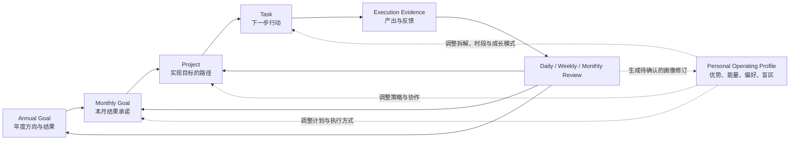

# 目标驱动的个人推进体系设计

> 状态：设计提案，尚未成为 runtime 数据合同  
> 基线日期：2026-07-21  
> 范围：年度与月度目标、Project、Task、Personal Operating Profile、规划复盘、kos-agent 和 Obsidian 看板

## 1. 文档目的

本文设计一套从长期方向到每日行动、再从真实结果反向修正目标和自我认识的个人推进体系。

它需要解决的不是“怎样保存更多待办”，而是以下连续问题：

1. 用户今年真正希望改变什么。
2. 本月应承诺什么结果，才能实际推进年度方向。
3. 哪些 Project 是实现目标的合理路径，哪些只是占用资源。
4. 每个 Project 下一步应执行什么 Task。
5. Agent 如何结合项目事实、当前状态和个人操作画像给出每日建议。
6. 执行结果如何进入周、月和年度复盘。
7. 哪些反馈应调整 Project，哪些应调整目标，哪些只能形成画像修订草稿。

核心关系为：

```text
Goal 决定去哪里
Project 决定通过什么路径
Task 决定下一步做什么
Personal Operating Profile 调整怎样推进
Review 根据结果持续纠偏
```

## 2. 背景与当前问题

kos 已经具有 Project、Task、Diary、Reflection、Personal Operating Profile、今日工作台和 Agent Skills，但当前能力仍是多个局部闭环：

- Project 可以保存 `goal`，但没有独立的年度或月度目标对象。
- Project 正文 checkbox 和独立 Task 同时存在，形成两套执行事实源。
- 看板能聚合项目、任务、到期、阻塞和停滞，但不会判断其对长期目标的贡献。
- Agent 可以创建、读取和修改对象，却没有稳定的目标规划 Context 和结构化推荐结果。
- 个人画像可以显式参与一次对话，但没有进入每日规划工作流。
- 任务完成数量可以被统计，但不能证明目标取得进展或用户能力得到提升。

如果继续只增强任务列表，系统会更擅长推动用户“完成更多”，却不一定帮助用户“完成真正重要的事”。

## 3. 设计目标

### 3.1 产品目标

- 建立年度目标、月度目标、Project 和 Task 的可追溯关系。
- 让用户每天都能看见最值得推进的少量行动，而不是所有待办。
- 让 Agent 能解释建议依据、发现断链并持续协助推进。
- 用结果证据而不是任务数量判断目标进展。
- 将个人画像作为可修正的协作假设，用于改善执行方式和安排成长挑战。
- 支持用户接受、调整、拒绝和延后建议，并让反馈进入后续复盘。
- 保持 Markdown 为长期事实源，插件和 Agent 不维护相互冲突的第二份业务状态。

### 3.2 工程目标

- 对象、状态、权限、RPC、插件模型和文档使用同一合同。
- 确定性事实由 kos-agent Harness 计算，语义判断由 LLM 完成。
- 看板只在用户明确触发工作流时调用模型，打开和刷新不产生隐式调用。
- 所有 Agent 写入都经过 Schema、状态和业务确认校验。
- 工作流可幂等恢复，重复点击不会创建重复计划、Task 或 session。
- 无目标、无画像或 Agent 不可用时仍能使用普通项目和任务管理。

## 4. 非目标

- 不建立企业级 OKR、审批、人员分派、工时核算或绩效考核系统。
- 不把年度目标机械拆成十二个相同月度指标。
- 不使用任务完成数量替代结果、成长或生活质量。
- 不让 Agent 决定用户的价值观、人生方向或最终优先级。
- 不把 MBTI、盖洛普或 Agent 观察当成人格真相。
- 不为了个性化只推荐用户擅长、熟悉或舒适的事项。
- 不在 framework 仓库收集、同步或发布个人目标、画像与复盘内容。
- 不引入 MCP；实现优先复用 Pi、kos-agent 现有资源加载、session、RPC、tools 和 extension 能力。

## 5. 设计原则

### 5.1 结果优先于活动

Task 完成只证明发生了行动。Goal 进展必须来自交付物、指标变化、用户反馈、验证结论或其他明确证据。

### 5.2 目标和执行之间必须有 Project

年度目标不直接挂大量 Task。Project 是目标到行动之间的策略和上下文容器，负责保存假设、阶段、里程碑、决策和结果。

### 5.3 独立 Task 是执行层唯一真相源

可跟踪、可排序、可完成的行动必须是 `type: task` 对象。Project 正文中的 checkbox 只能作为 Task 引用、临时草稿或迁移来源，不能继续参与另一套状态统计。

### 5.4 画像只调整推进方式

Personal Operating Profile 可以影响任务拆解、时段、协作方式、风险提醒和成长安排，但不能决定用户应该追求什么目标。

### 5.5 个性化同时包含优势发挥和成长挑战

推荐必须能标明：

- `leverage`：利用稳定优势提高产出。
- `stretch`：训练对目标重要但尚不稳定的能力。
- `neutral`：普通执行或维护事项。

画像不能成为回避必要挑战的理由。

### 5.6 建议和决定分离

Agent 可以生成建议、草稿和候选关系；年度/月度目标激活、目标优先级改变、Project 重大转向和画像激活属于业务决定，必须由用户明确确认。

这不是 permission mode。kos-agent 仍只有 YOLO 执行模式；`ask_question` 用于缺失信息和业务取舍，不用于逐次请求文件或命令授权。

### 5.7 推荐必须可解释

不使用无法解释的单一总分驱动每日计划。系统先计算确定性约束，再让 Agent 基于结构化维度比较，并展示简明理由与来源。

## 6. 总体模型



关系约束：

```text
Annual Goal 1..N Monthly Goal
Monthly Goal N..N Project
Project 1..N Task
Task 0..N Evidence
Goal / Project / Task N..N Review
Profile 只通过 applies_to 和工作流选择器参与
```

`Evidence` 和 `Review` 在 MVP 中不是新的通用对象类型：

- Evidence 是带来源的结果记录，可以存在于 Goal 指标、Project 进展、Task 结果、Diary、Reflection 或外部 Source 中。它必须保留来源路径和日期，但不为了统一命名再复制一份内容。
- Review 是工作流和产物角色。日终落到 Diary，周度判断可以落到 Reflection 或 Project，月度判断写回 Goal 的复盘与证据章节。只有出现无法由这些对象承载的稳定需求时，才评估独立 review 类型。

## 7. Goal 对象设计

### 7.1 统一 Goal 类型

年度和月度目标共用一个 `goal` 类型，通过 `horizon` 区分。这样季度、周期挑战或其他时间尺度可以在不复制对象模型的情况下扩展。

推荐路径：

```text
30_目标/年度/YYYY/<目标名>.md
30_目标/月度/YYYY-MM/<目标名>.md
```

### 7.2 Goal frontmatter 草案

```yaml
type: goal
title: "建立稳定的内容业务"
horizon: annual
goal_kind: outcome
status: draft
priority: P1
health: unknown
period_start: 2027-01-01
period_end: 2027-12-31
parent_goals: []
related_projects: []
review_cadence: monthly
created: 2026-12-20
updated: 2026-12-20
human_confirmed: false
tags: [goal]
```

`goal_kind`：

```text
outcome      可观察的外部或内部结果
capability   需要长期实践和证据的能力建设
maintenance  需要维持的健康、家庭、财务或系统状态
```

`health` 使用 `unknown|on_track|at_risk|off_track`，表示当前预测，不替代生命周期 `status`，也不能自动写成 `achieved`。

### 7.3 Goal 正文结构

```text
## 为什么重要
## 期望结果
## 成功标准
## 指标与基线
## 不做什么
## 约束与代价
## 关联月度目标
## 关联项目
## 进展证据
## 风险与偏差
## 复盘记录
```

指标允许多个，每个指标需要稳定 ID：

```yaml
metrics:
  - id: paying-users
    name: 付费用户数
    unit: people
    baseline: 0
    target: 100
    current: 0
    updated: 2027-01-01
    source: ""
```

现有通用 Schema Validator 只支持基础 list，不支持列表成员 Schema。实现 Goal 前必须扩展结构化列表校验，不能用不可验证的任意 YAML 代替。

### 7.4 Goal 生命周期

```text
draft -> active -> paused -> active
active|paused -> achieved|abandoned
achieved|abandoned -> archived
```

规则：

- Agent 可以创建 `draft`。
- `draft -> active` 必须由用户确认。
- 年度/月度目标的 `priority`、成功标准、目标值和父目标关系是受保护字段。
- `achieved` 必须引用结果证据；不能根据 Task 完成率自动判定。
- `abandoned` 需要记录停止原因，避免把战略取舍误判为执行失败。
- 过期的 active 目标必须进入复盘，不能静默滚动到下一周期。

### 7.5 年度和月度目标的区别

年度目标回答“今年希望发生什么变化”，月度目标回答“本月承诺验证或交付什么结果”。

月度目标不是年度目标的数值除法，而是阶段性选择：

```text
年度目标：建立稳定的内容业务
月度目标：验证案例拆解是否能产生有效咨询
```

每个月只激活少量结果承诺。没有容量的目标保持 draft 或进入后续候选，不能让所有年度目标同时产生 active Project。

## 8. Project 对象设计

### 8.1 Project 的职责

Project 是实现目标的一次有限投入假设，负责保存：

- 为什么选择这条路径。
- 预期交付物和成功标准。
- 当前阶段和下一里程碑。
- 关键决策、进展、风险和停止条件。
- 对一个或多个 Goal 的预期贡献。

Project 不是目标本身，也不是 Task 集合的容器替代品。

### 8.2 Project 合同调整

保留现有 Project，并增加或明确：

```yaml
type: project
title: "发布四篇案例拆解"
status: idea
category: writing
priority: P1
area: "[[内容业务]]"
goal_links:
  - goal: "[[30_目标/月度/2027-01/验证案例内容转化]]"
    role: primary
    contribution: "用四次发布验证内容到咨询的转化"
strategy_hypothesis: "具体案例比通用方法文章更容易产生有效咨询"
current_stage: "设计验证"
next_milestone: "发布第一篇并取得五条有效反馈"
due: 2027-01-25
created: 2027-01-02
updated: 2027-01-02
related_sources: []
related_research: []
related_concepts: []
related_methods: []
tags: []
```

`goal_links.role`：

```text
primary     Project 的主要存在理由
supporting  Project 同时支持的其他目标
```

### 8.3 Project 生命周期

统一三层合同为：

```text
idea -> active
active -> paused|blocked|completed|cancelled
paused|blocked -> active|cancelled
completed|cancelled -> archived
```

规则：

- `idea` 可以由 Agent 创建。
- 激活 Project 表示用户愿意投入容量，需要明确业务确认。
- `blocked` 必须记录阻塞原因、责任方和下一次检查时间。
- `completed` 必须记录最终成果和 Goal 贡献证据。
- `cancelled` 必须记录停止原因和保留的沉淀。
- `archived` 只表示退出当前工作面，不代表成功。

### 8.4 Project 组合约束

系统提供默认 WIP 提醒，但不把数量写死为不可修改的框架规则：

- active Project 超过用户配置上限时提示容量风险。
- active Project 应关联至少一个 active 月度 Goal，或标记为 `maintenance` / `exploration`。
- 每个 active Project 必须有 `next_milestone` 和至少一个开放 Task。
- 长期没有更新、开放 Task 或进展证据的 Project 标记为 stale。

## 9. Task 对象设计

### 9.1 唯一事实源

所有进入排序、到期、阻塞、完成、交给 Agent 或统计的行动都必须位于：

```text
32_任务/
```

Project 的“当前任务”章节改为自动引用或查询，不再存储独立 checkbox 状态。临时 checkbox 可以存在，但不进入系统指标；用户可以显式转换为 Task。

### 9.2 Task frontmatter 调整

```yaml
type: task
title: "归纳十次用户访谈中的重复问题"
status: todo
project: "[[31_项目/用户访谈验证]]"
priority: P1
due: 2027-01-08
scheduled_times: ["09:00"]
estimate_minutes: 90
energy: high
work_mode: deep
growth_mode: leverage
depends_on: []
blocked_reason: ""
created: 2027-01-05
completed: ""
tags: []
```

字段含义：

| 字段 | 用途 |
|---|---|
| `project` | Task 的执行上下文；普通项目 Task 必须关联 |
| `scheduled_times` | 可选的本地 `HH:mm` 时刻数组；与 `due` 共同驱动当日任务时刻卡，不替代截止日期 |
| `estimate_minutes` | 容量估算，不用于绩效或精确工时 |
| `energy` | `low/medium/high`，表示执行所需认知能量 |
| `work_mode` | `deep/collaboration/admin/field` |
| `growth_mode` | `leverage/stretch/neutral` |
| `depends_on` | 前置 Task 或外部依赖 |
| `blocked_reason` | blocked 状态的必要解释 |

Task 正文保存描述、完成定义、执行材料、阻塞和结果证据，不复制 Project 的长期背景。

### 9.3 Task 生命周期

```text
todo -> doing|blocked|cancelled
doing -> done|blocked|cancelled
blocked -> todo|doing|cancelled
done|cancelled 为终态并保留历史
```

规则：

- `done` 自动写入 `completed`。
- `blocked` 必须有 `blocked_reason`。
- Task 标题应以可观察动作表达，避免“继续项目”“处理一下”等模糊描述。
- 完成定义不足时，Agent 应先补充或提出业务问题。
- 自动规划只能生成 Task draft 建议；只有用户要求执行规划或接受建议后才创建正式 Task。

### 9.4 独立非项目 Task

允许少量不属于 Project 的 Task，但必须标记原因：

```yaml
task_scope: maintenance|administrative|inbox
```

无 `project` 且无 `task_scope` 的开放 Task 视为 orphan，并进入系统检查。

## 10. Personal Operating Profile 的作用

### 10.1 参与边界

只有以下画像可以进入规划 Context：

- `status: active`。
- 已有人确认元数据。
- `applies_to_skills` 包含当前工作流，或其适用场景明确匹配。
- 没有被“不适用场景”排除。

规划工作流不自动读取 draft、reviewed 或 archived 画像。

### 10.2 可影响的内容

画像可以影响：

- 高认知任务的建议时段。
- 大任务拆解粒度。
- Agent 提供结论、选项或问题的顺序。
- 独立推进、共同探索或外部问责的协作方式。
- 决策盲区和反复拖延模式的提醒。
- `leverage` 和 `stretch` 任务的组合。

画像不能影响：

- 用户目标的价值判断。
- 法律、健康、财务等硬约束。
- 已确认承诺是否需要履行。
- 目标进度和任务完成事实。

### 10.3 画像反馈闭环

以下行为只能产生画像修订建议：

- 某类任务长期高完成或持续回避。
- 用户反复调整同类推荐。
- 精力记录与画像中的能量假设冲突。
- 项目结果支持或推翻某个协作假设。

Agent 把建议写入新的 draft 或画像中的“仍需验证假设”，不能直接改写 active 结论。

## 11. 规划节奏

### 11.1 年度规划

输入：过去年度复盘、当前责任、资源约束、长期方向和 active 画像。

输出：少量年度 Goal draft，包括成功标准、不做什么、风险和首个验证周期。用户确认后才 active。

### 11.2 月度规划

输入：active 年度 Goal、上月结果、当前 Project 组合、可用容量、维护义务和成长方向。

流程：

```text
检查年度目标偏差
-> 提出本月候选结果
-> 估算容量与冲突
-> 选择少量 active 月度目标
-> 继续、暂停、取消或新建 Project
-> 为 active Project 确认下一里程碑和开放 Task
```

### 11.3 周度复盘与计划

周度不新增一层 Goal。它负责：

- 检查月度目标是否仍可达成。
- 清理 stale、blocked 和超 WIP Project。
- 确认每个 active Project 的下一里程碑。
- 补齐下一步 Task。
- 安排本周必须完成、可选和成长性工作。

### 11.4 每日开始

打开看板只加载确定性数据。用户点击“开始一天”后：

```text
构造 PlanningContext
-> 恢复或创建当天 Agent session
-> 运行 kos-start-my-day
-> Agent 生成结构化推荐
-> 看板展示依据和候选动作
-> 用户接受、调整、拒绝或延后
-> 创建或流转对应 Task
-> 写入今日工作台的系统管理块
```

### 11.5 日终

日终记录：

- 完成的 Task 和实际结果。
- 未完成原因，不默认解释为意志或画像问题。
- Project 的新证据、阻塞和判断变化。
- 明天继续事项。
- 可能需要进入 Reflection 或画像 draft 的观察。

### 11.6 月末复盘

月末不以 Task 数量评判成败。每个 active 月度 Goal 必须回答：

- 成功标准是否满足，有什么证据。
- 哪个 Project 有效，哪个假设被推翻。
- 未达成主要因为目标、策略、容量、执行、外部条件还是测量错误。
- 下月应继续、调整、暂停还是停止。
- 对年度 Goal 的预测发生了什么变化。

## 12. PlanningContext 设计

### 12.1 确定性构造

新增 kos-agent 领域 Context 构造器，建议位置：

```text
agent/packages/kos-agent/src/kos/context/planning-context.ts
```

Context 至少包含：

```ts
interface PlanningContext {
  date: string;
  annualGoals: GoalSummary[];
  monthlyGoals: GoalSummary[];
  projects: ProjectSummary[];
  tasks: TaskSummary[];
  recentEvidence: EvidenceSummary[];
  recentDiary: DiarySummary | null;
  profiles: ProfileHypothesisSummary[];
  capacity: CapacitySummary;
  anomalies: PlanningAnomaly[];
  provenance: ContextSource[];
}
```

### 12.2 选择规则

- Goal：当前周期且 `active`。
- Project：`active`、`blocked`、`paused`、stale 或本期 Goal 关联项目。
- Task：开放、逾期、今日到期、doing、blocked，以及候选 Project 的下一步 Task。
- Diary：昨日和最近有有效 energy/复盘的少量记录。
- Profile：满足第 10.1 节选择边界的 active 假设。
- 系统异常：orphan Task、无下一步 Task 的 active Project、目标断链、过期目标、超 WIP 和 Validator findings。

### 12.3 Context 安全和容量

- 结构化摘要与原文件路径同时提供，Agent 可按需读取原文。
- 每条摘要保留来源路径、更新时间和选取原因。
- 用户内容作为数据，不提升为 system instruction。
- Profile 结论必须标记为 hypothesis。
- 超出 Context 预算时优先保留硬约束、当前目标、doing/blocked Task 和来源路径。
- Compaction 必须保留用户确认的目标、今日决定、未完成问题和 Task 路径。

## 13. 每日推荐协议

### 13.1 推荐不是自由文本

Agent 可以附带说明，但看板依赖结构化结果：

```ts
interface DailyRecommendation {
  date: string;
  runId: string;
  generatedAt: string;
  contextFingerprint: string;
  summary: string;
  items: RecommendationItem[];
  questions: BusinessQuestion[];
}

interface RecommendationItem {
  id: string;
  rank: number;
  taskPath?: string;
  proposedTask?: ProposedTask;
  title: string;
  reason: string;
  goalPaths: string[];
  projectPath?: string;
  constraintReasons: string[];
  unlocks: string[];
  profileUses: ProfileUse[];
  estimateMinutes?: number;
  suitableWindow?: string;
  tradeoff: string;
  status: "recommended" | "accepted" | "adjusted" | "rejected" | "deferred";
}
```

`profileUses` 必须包含画像路径、假设摘要和 `leverage|stretch`，不能只写“根据你的性格”。

### 13.2 排序过程

第一步由系统处理硬约束：

```text
紧急安全或外部承诺
-> 阻塞解除和依赖解锁
-> 逾期、今日到期和已 doing
-> active 月度 Goal 的高贡献下一步
-> 维护任务和成长挑战
```

第二步由 Agent 比较以下维度：

- 对 active 月度 Goal 的贡献。
- 是否解锁其他 Task 或 Project。
- 时间窗口、依赖和延迟代价。
- Project 当前风险和停滞程度。
- 用户当日容量和任务能量要求。
- 相关画像假设与不适用场景。
- `leverage` 与 `stretch` 的组合是否合理。

不对用户展示一个伪精确总分。需要稳定排序时使用上述维度的字典序和明确 tie-breaker，并把命中的关键维度写入 `reason`。

### 13.3 推荐数量

默认最多三项：

1. 一个对当前月度结果最重要的推进项。
2. 一个解除阻塞、履行硬承诺或维护系统的事项。
3. 一个可选的成长挑战或低成本收尾事项。

这不是强制凑满三项。容量不足、只有一个关键任务或需要先回答业务问题时，应减少推荐数量。

### 13.4 用户反馈

用户可以：

- 接受：使用现有 Task 或确认创建 proposed Task。
- 调整：修改范围、时段、拆解、预计投入或成长模式。
- 拒绝：记录主要原因。
- 延后：指定重新出现的日期或条件。

拒绝原因最少区分：

```text
goal_conflict
wrong_timing
insufficient_capacity
bad_decomposition
missing_context
profile_mismatch
already_done
not_valuable
other
```

不能把所有拒绝都归因于画像错误。

## 14. Agent 与 Harness 职责

### 14.1 Harness 负责

- 读取、校验和关联 Goal、Project、Task、Diary 与 Profile。
- 计算日期、到期、停滞、WIP、依赖、orphan 和关系断链。
- 构造 PlanningContext 和 fingerprint。
- 执行对象创建、字段更新、状态流转和 managed block 写入。
- 强制状态、确认、幂等性和路径约束。
- 返回结构化 Validator、操作结果和 trace。

### 14.2 LLM 负责

- 澄清目标、成功标准和业务取舍。
- 判断 Project 是否仍是合理路径。
- 将里程碑拆成可执行 Task。
- 比较多个合法候选的目标贡献和解锁价值。
- 解释推荐并提出必要问题。
- 从复盘中提出 Reflection 或画像修订草稿。

### 14.3 Agent 不负责

- 编造用户没有确认的目标和价值排序。
- 把 Task 完成率写成 Goal 已达成。
- 静默激活 Goal、改变 Goal 优先级或重写 active Profile。
- 根据一次失败给出稳定人格结论。
- 绕过确定性操作直接制造不受管理的第二份状态。

## 15. kos-agent 操作与 RPC

在现有 `create_object`、`transition_status` 和 `daily_workflow` 基础上增加领域操作：

```text
create_goal
update_goal
link_goal_project
create_task
update_task
transition_task
update_project
resolve_blocker
get_planning_context
run_planning_workflow
record_recommendation_feedback
```

`run_planning_workflow` 至少支持：

```text
annual_review
monthly_plan
weekly_review
start_day
end_day
```

RPC 返回确定性结果，Agent 对话和看板使用同一个 session。领域操作不能只存在于 CLI，否则插件会再次通过自由文本和 bash 间接调用。

## 16. Skills 设计

建议增加或重构：

```text
kos-create-goal
kos-review-goal
kos-plan-month
kos-review-week
kos-create-task
kos-update-task
kos-resolve-blocker
kos-start-my-day
kos-end-my-day
kos-update-project
```

Skill 必须：

- 先读取对象规范和对应 Context。
- 优先调用领域 RPC/Harness，不手工拼接 frontmatter。
- 明确业务确认点。
- 输出对象路径、使用的目标、关键依据和 Validator 结果。
- 有 Contract Gate、Process Eval 和至少一个结果场景 Eval。

## 17. Obsidian 产品设计

### 17.1 目标视图

提供年度和月度两个视图，不以营销式大卡片展示。重点是：

- 当前 active Goal、结果指标和风险。
- 父子目标关系。
- 关联 Project 及其贡献状态。
- 本期尚无执行路径的目标。
- 月初计划和月末复盘入口。

### 17.2 行动视图

Project 和 Task 继续使用紧凑、可扫描的操作界面：

- Project 展示 Goal 关系、阶段、里程碑、进度证据、阻塞和下一步 Task。
- Task 展示 Project、目标继承关系、状态、优先级、到期、能量和工作模式。
- 可以直接开始、完成、阻塞、拆分、交给 Agent 或打开上下文。
- 项目正文 checkbox 提供“转换为 Task”，转换成功后替换为 Task wikilink。

### 17.3 今日视图

今日视图明确区分：

- 确定性事实：到期、逾期、doing、blocked、WIP 和异常。
- Agent 建议：推荐时间、使用的 Context、理由和画像假设。
- 用户计划：已经接受或调整的今日主线。

只有真实的结构化 Agent 推荐写入后，才能显示 `Agent 建议 · HH:mm`。Agent session 结束不能直接把确定性排序冒充为 Agent 建议。

### 17.4 Review 视图

Review 视图聚合：

- 待确认 Goal 和重大目标变更。
- Project 完成、取消和方向调整。
- 月度结果判断。
- 画像修订 draft。
- 推荐拒绝或持续调整形成的待判断模式。

## 18. 持久化与唯一真相源

### 18.1 Vault Markdown

长期事实写入 Vault：

- Goal、Project、Task 和 Profile。
- 用户确认的关系和状态。
- 进展证据、决策、复盘和画像修订。
- 今日工作台中已确认的计划。

### 18.2 插件私有状态

插件 `data.json` 只保存：

- 视图设置和筛选。
- snapshot、badge 和可重建指标缓存。
- 每日工作流运行状态、session ID 和 UI 恢复信息。
- 尚未落盘的临时推荐交互状态。

插件私有状态不能成为 Goal、Project、Task 或 Profile 的唯一来源。

### 18.3 Session

Session 保存完整对话、工具调用、问题和 recommendation trace。需要长期使用的决定必须写回 Vault，不能只留在 session。

### 18.4 今日工作台 managed block

推荐和用户确认计划写入带稳定 ID 的系统管理块，手动区域继续受保护：

```markdown
<!-- kos:daily-plan:start run_id="..." -->
...
<!-- kos:daily-plan:end -->
```

同一天重复运行按 `run_id` 和 Context fingerprint 处理：Context 未变化时恢复结果；Context 已变化时生成新版本并保留用户已经确认的 Task 状态。

## 19. 指标设计

本文只定义候选指标。正式实现前必须写入 `ob-plugin/docs/03_指标定义.md`，该文件继续作为插件量化展示的唯一口径。

### 19.1 结果指标

- active Goal 中有最新证据的比例。
- 月度 Goal 成功、调整、放弃和无结论数量。
- 年度 Goal 的 on-track / at-risk / off-track 分布。

### 19.2 对齐指标

- active Project 关联 active 月度 Goal 的比例。
- orphan Task 数量和比例。
- 没有开放 Task 的 active Project 数量。
- 没有 Project 的 active 月度 Goal 数量。

### 19.3 流动指标

- active Project WIP。
- stale Project 数量和停滞天数。
- blocked Task 数量、阻塞时长和解除时间。
- 月度承诺 Task 的按期完成率。

### 19.4 推荐质量指标

- 推荐接受、调整、拒绝和延后比例。
- 各拒绝原因分布。
- 接受后完成率，但不把它作为唯一质量指标。
- 推荐后被重新拆解的比例。
- 用户认为理由有用的反馈。

### 19.5 成长证据

- capability Goal 的实践次数和结果证据。
- `stretch` Task 的完成、调整和反馈。
- 被支持、被推翻和仍待验证的画像假设数量。

不建立单一“个人成长分”。不同目标、能力和人生领域不能被压成一个缺乏解释力的分数。

## 20. 权限与业务确认

以下变化需要用户明确确认并记录元数据：

- Goal draft -> active。
- Goal 优先级、目标值、成功标准和父目标变化。
- Goal achieved 或 abandoned。
- Project idea -> active、重大 Goal 关系变化、completed 或 cancelled。
- 推荐创建超出当前 active Project 范围的新 Project。
- Profile reviewed / active / verified / mature。

Agent 可以自主执行：

- 在用户已确认的规划任务内创建 Task。
- 更新普通进展、阻塞描述和证据引用。
- 运行 Validator、刷新看板和生成复盘草稿。
- 对已确认关系做机械性同步。

业务确认通过 `ask_question`、看板确认控件或用户明确消息完成，不引入 safe/strict/approval mode。

## 21. 失败模式

### 21.1 任务完成幻觉

大量完成小 Task，但 Goal 指标没有变化。系统必须把活动指标和结果指标分开。

### 21.2 目标层级膨胀

建立年度、季度、月度、周度、每日多层目标，维护成本高于价值。设计只保留年度与月度 Goal，周和日是计划与复盘视图。

### 21.3 两套 Task 状态

Project checkbox 与独立 Task 重复计数或状态冲突。迁移后只有独立 Task 进入指标。

### 21.4 画像舒适区陷阱

Agent 只推荐符合已有优势和偏好的任务。推荐必须允许 `stretch`，并说明挑战与目标关系。

### 21.5 目标僵化

为了保持完成率而继续无价值 Project。复盘必须允许基于证据取消目标或路径，并区分战略调整与执行失败。

### 21.6 错误归因

一次未完成可能来自外部依赖、错误拆解、资源不足或目标冲突，不能直接归因于性格、动力或能力。

### 21.7 Agent 越权

Agent 把建议直接写成 active Goal、用户承诺或人格判断。Harness 必须强制业务确认和状态元数据。

### 21.8 推荐不可追溯

看板只显示一句建议，无法知道使用了哪些 Goal、Project 和画像。结构化推荐必须保存路径和 Context fingerprint。

### 21.9 隐私外泄

个人目标、画像和日记可能包含敏感信息。framework 同步不触碰个人目录内容；Context 只选择当前工作流所需的最小信息。

## 22. 迁移设计

### 22.1 现有 Project goal

扫描现有 Project `goal` 字段，生成候选 Goal draft 和关联建议，不自动创建 active Goal。原字段保留到用户确认迁移完成。

### 22.2 Project checkbox

迁移工具：

1. 扫描 `## 当前任务`。
2. 为每个未完成 checkbox 生成 proposed Task。
3. 用户确认项目、优先级和 due。
4. 创建独立 Task。
5. 将 checkbox 替换为稳定 Task wikilink 或系统管理查询。
6. 重复运行不创建重复 Task。

### 22.3 状态合同

在迁移 Goal 前先统一 `blocked` 等 Project 状态在对象规范、Schema、agent state machine、插件类型和测试中的定义。

### 22.4 降级兼容

- 没有 Goal：Project 和 Task 继续工作，看板提示未建立目标关系但不阻塞。
- 没有 Profile：推荐仅依据目标、项目、Task、日期和状态。
- Agent 不可用：看板继续展示确定性排序和异常。
- 老 Project checkbox：迁移前继续显示，但明确标记为 legacy，不与独立 Task 混合统计。

## 23. Eval 与验证

### 23.1 单元测试

- Goal Schema、路径和状态机。
- Goal、Project、Task 关系校验。
- checkbox 迁移幂等性和回滚。
- PlanningContext 选择、排序和容量裁剪。
- 推荐反馈状态和拒绝原因。
- managed block 保留人工内容。

### 23.2 集成测试

- Obsidian -> kos-agent RPC 创建和更新 Goal、Project、Task。
- 看板开始一天 -> session -> recommendation -> 接受 -> Task 创建/流转。
- Agent 中断、重启和 ask_question 恢复。
- 同一天重复运行和 Context 变化。
- Project 完成证据回写和月度复盘。

### 23.3 Process Eval

验证 Agent 是否：

- 读取正确 Skill 和 PlanningContext。
- 使用领域操作而不是自由拼接 frontmatter。
- 在目标取舍处调用 `ask_question`。
- 不读取不适用或未激活画像。
- 输出结构化推荐和来源路径。
- 在 Validator 失败后修复并重试。

### 23.4 场景 Eval

至少覆盖：

- 多个目标竞争有限容量。
- active Goal 没有 Project。
- active Project 没有下一步 Task。
- Task 逾期但对当前目标贡献很低。
- blocked Task 解锁多个后续任务。
- 画像建议与硬承诺冲突。
- 画像只支持优势发挥，但目标需要成长挑战。
- 用户连续拒绝同类推荐。
- 没有 Goal、没有 Profile 和没有 Agent 的降级路径。

### 23.5 效果评估边界

长期目标贡献依赖个人选择、延迟反馈和外部因素，不作为 framework release 的单一门禁。Framework 门禁检查合同、流程、可解释性和安全边界；长期效果保留为个人 runtime 的可选观察数据。

## 24. 分阶段实施

### Phase 0：修复现有合同

- 统一 Project 状态和人工确认规则。
- 修复 Skill 文档与 CLI/RPC 字段漂移。
- 明确独立 Task 与 Project checkbox 的边界。
- 增加 Project/Task 跨层合同测试。

验收：对象规范、Schema、agent、插件和测试对同一 fixture 给出一致结果。

### Phase 1：Goal 核心

- 增加 Goal 目录、模板、Schema、状态机、Harness 和文档。
- 支持年度/月度 Goal 和父子关系。
- 增加 Goal 与 Project 关系校验。

验收：可从 Obsidian 或 Agent 创建 draft，经用户确认激活，并通过 Validator。

### Phase 2：Task 唯一事实源

- 增加 create/update/transition Task 领域操作和 RPC。
- 迁移 Project checkbox。
- 统一 Project、Task 进度与今日工作台。

验收：任何入口创建的行动都能在看板、每日工作台、项目进度和状态流转中一致出现。

### Phase 3：规划 Context 与 Agent 工作流

- 实现 PlanningContext。
- 增加年度、月度、周度和每日 Skills。
- 增加结构化 recommendation protocol。

验收：Agent 能从 Goal 到 Task 给出可追溯建议，并在业务取舍处等待用户判断。

### Phase 4：看板闭环

- 增加目标视图和真实 Agent 建议区。
- 支持接受、调整、拒绝和延后。
- 同一 session 展示进度、问题、diff 和最终结果。

验收：用户无需在看板和聊天之间重复描述上下文，推荐动作能直接落到 Task。

### Phase 5：复盘、个性化与效果评估

- 接入月度结果复盘和画像选择器。
- 支持 `leverage/stretch` 推荐。
- 增加反馈、指标和画像修订 draft。
- 完成 Process Eval 和场景 Eval。

验收：系统能区分目标、策略、执行和画像层面的偏差，不把未完成简单归因于用户。

## 25. 完整示例

年度 Goal：

```text
建立稳定的内容业务
成功标准：形成可重复获客方式，并达到确认的收入或用户指标
```

一月 Goal：

```text
验证案例拆解内容能否产生有效咨询
成功标准：发布四篇，获得至少十条目标用户反馈和三次有效咨询
```

Project：

```text
发布四篇案例拆解
策略假设：具体案例比通用方法文章更容易形成信任和咨询
下一里程碑：第一篇发布并收集五条反馈
```

Task：

```text
归纳十次历史咨询中的重复问题
estimate_minutes: 90
energy: high
work_mode: deep
growth_mode: leverage
```

画像假设：

```text
高能量时更适合从复杂材料中归纳结构；低能量时适合整理和发布。
公开表达销售主张容易延后，但它是当前目标需要训练的 stretch 能力。
```

Agent 今日建议：

```text
1. 上午归纳历史咨询问题
   - 贡献：为一月 Goal 的第一篇案例提供核心素材
   - 解锁：文章提纲和访谈问题
   - 画像：leverage，高能量时段使用结构归纳优势

2. 确认第一篇案例的明确行动号召
   - 贡献：没有行动号召无法验证咨询转化
   - 画像：stretch，训练公开表达价值和请求下一步

3. 下午整理并预约两次反馈访谈
   - 贡献：建立发布后的反馈渠道
   - 画像：低能量可执行的协作型任务
```

日终如果第二项未完成，系统先询问原因。若原因是行动号召定义不清，应调整 Project 或拆解 Task；只有长期重复且多场景成立时，才形成画像修订 draft。

## 26. 已选择方案与替代方案

### 26.1 一个 Goal 类型，而不是年度/月度两个对象类型

选择统一 `goal + horizon`，减少重复 Schema、Skill 和插件分支，并为季度等周期保留扩展空间。

### 26.2 独立 Task，而不是继续维护双轨 checkbox

选择独立 Task，因为状态、到期、依赖、阻塞、Agent 操作和指标都需要稳定对象身份。Project 正文继续展示引用，但不保存第二套状态。

### 26.3 工作流级 Profile Context，而不是全局注入

选择按工作流读取 relevant active 画像，避免人格标签污染所有回答，也控制 Context 成本。

### 26.4 可解释排序向量，而不是单一优先级分数

选择硬约束加语义维度，避免伪精确分数掩盖目标冲突和业务判断。

### 26.5 显式触发 Agent，而不是打开看板自动运行

选择“开始一天”等显式动作，保证成本、幂等性和用户预期清晰；普通浏览始终使用确定性数据。

## 27. 待裁决问题

- Goal 指标结构是否采用嵌套 YAML，还是拆成独立 evidence/metric 对象。
- `maintenance` 应作为 Goal kind、Project class，还是两者都需要。
- Project 激活是否总要业务确认，还是用户在明确创建 active Project 时视为已确认。
- 推荐反馈长期保存在哪个 managed block，日终后如何归档进 Diary。
- 月度 Goal 是否允许同时关联多个年度 Goal，以及如何展示贡献而不使用虚假权重。
- capability Goal 的结果证据需要哪些通用字段，才能跨写作、销售、研究和健康领域使用。
- 移动端没有本地 kos-agent 时，哪些 Goal/Task 直接操作仍应可用。

## 28. 相关文档与真相源

- `vault/90_系统/规则/对象规范.md`
- `vault/90_系统/文档/21_对象生命周期.md`
- `vault/90_系统/文档/22_个人操作画像.md`
- `vault/90_系统/文档/23_项目与任务.md`
- `vault/80_Skills/core/kos-create-project/SKILL.md`
- `vault/80_Skills/core/kos-update-project/SKILL.md`
- `vault/80_Skills/core/kos-start-my-day/SKILL.md`
- `agent/docs/02_总体架构.md`
- `agent/docs/03_Pi工具与扩展设计.md`
- `ob-plugin/docs/03_指标定义.md`
- `ob-plugin/docs/04_看板产品与交互设计需求.md`
- `dev/docs/个性化协作与每日推荐优化.md`
- `dev/docs/Obsidian看板二期优化.md`

本文在评审通过前只是设计提案，不覆盖现有对象规范。实施时应按 Phase 拆分，每一阶段同时更新对象规范、Schema、Agent 操作、插件合同、runtime 用户文档和对应 Eval，最后运行 `make release-check`。
