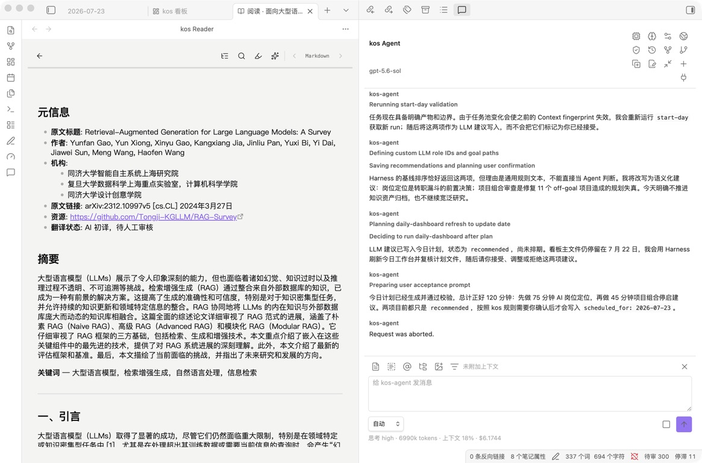

# 读书与阅读

kos 的读书流程不是把一本书直接变成“读书笔记”。更稳的方式是分层处理：

```text
Book Source -> Extract -> Summary -> Research / Concept / Method
```

每一层职责不同。Source 保存书籍来源和原始材料；Extract 保存忠实摘录；Summary 保存可审核摘要；Research、Concept、Method 才是知识和方法沉淀。

## kos 可以支持什么

针对个人读一本书，kos 可以支持：

- 选书前：记录为什么读、服务哪个问题或项目。
- 阅读中：保存目录、进度、划线、摘录和阶段性问题。
- 阅读后：生成待审核摘要，写读后复盘，提炼判断变化。
- 沉淀时：把书中可复用内容拆成 Research、Concept、Method。
- 行动上：把书中的启发关联到 Project 或 Task。

针对建立自己的书库和读书体系，kos 可以支持：

- 统一登记所有书籍 Source。
- 区分待读、在读、读完但未整理、已沉淀。
- 按主题、项目、研究问题关联书籍。
- 保留每本书的阅读目的和处理状态。
- 把多本书围绕同一问题汇总为 Research。
- 把跨书重复出现的概念沉淀为 Concept。
- 把经过实践的方法沉淀为 Method。

kos Companion 已提供 Obsidian 内的基础 Reader，让 PDF、EPUB 与 Source、进度和后续知识处理使用同一条工作流。它不替代原文版权库、DRM 平台、电子书商店或完整文献管理软件。

## 书籍作为 Source

按对象规范和常规 ingest 流程，书籍输入源位于：

```text
11_原材料/书籍/
```

frontmatter：

```yaml
type: source
format: book
title: "书名"
author: ""
source_url: ""
source_location: ""
created: YYYY-MM-DD
status: captured
related_topics: []
related_projects: []
importance: medium
summary_file: ""
extract_file: ""
tags: [book]
```

Source 只记录来源信息、目录、原始材料或阅读目的。不要把个人理解直接写进 Source。

## 在 Obsidian 中使用 kos Reader



Reader 是独立的 Obsidian 中央视图，不在看板中内嵌，也不会随看板打开而自动启动。可以从以下入口手动打开：

- 在看板“输入”区点击 Source 标题或 Reader 图标。
- 在 Obsidian 文件树中直接点击 EPUB。
- 在 PDF 或 EPUB 文件上右键，选择“使用 kos Reader 打开”。
- 选中 PDF 或 EPUB 后，从命令面板运行“使用 kos Reader 打开当前文件”。

EPUB 之所以能出现在文件树，是 kos Companion 在加载时通过 Obsidian 插件 API 注册了 `.epub` 扩展。这不是对 Obsidian 应用本体的修改：禁用或卸载插件后注册随之消失；发布包中的 `main.js` 已包含 React 和 epub.js，使用者不需要另外安装前端依赖。若同时安装其他接管 EPUB 的插件，默认打开方式可能取决于插件加载顺序。

直接打开 PDF 或 EPUB 时，插件会先按 Vault 路径查找 `source_location` 指向该文件的 Source。没有关联记录时，会读取 `90_系统/模板/BookSource_书籍输入源模板.md`，在 kos Companion 设置的 Source 根目录中创建 Source 并写入 `source_location`；标准默认根目录是 `11_原材料/`，因此这个自动关联入口与常规 ingest 写入 `11_原材料/书籍/` 的路径不同。索引按 `type` 识别对象，不受这一路径差异影响；同名文件已存在时不会覆盖。此过程是确定性文件操作，不调用模型。

当前 Reader 支持：

- Source Markdown、本地有文字层 PDF 和无 DRM EPUB。
- 文档目录、上一页/下一页和阅读进度条；PDF 默认纵向连续滚动，EPUB 默认跨章节连续滚动并可从工具栏切换分页阅读。
- PDF 页码与 EPUB CFI 位置恢复。
- EPUB 自适应排版和窄屏布局。
- 在当前文档中搜索并从结果跳回对应页、章节或 Markdown 内容。
- 选中文本后点击“划线”或“批注”；可选择黄、红、蓝、绿四色，并在“划线与批注”面板跳回原文或删除。
- 划线和批注写入关联 Extract；首次创建 Extract，后续继续追加，重复点击不会重复写入，重新打开 Reader 后会恢复回显。
- 选中文本后点击“添加到 Agent”，把原文、Source、原文件和位置填入 Agent 输入框；需要用户检查并手动发送。
- 从“阅读摘要”面板把当前页/章节或本次阅读会话的 Summary 请求填入 Agent 输入框；请求包含有界正文与本次批注证据，不会自动发送。

阅读进度保存在插件私有 `data.json`，以 Source 路径为键，不回写 Source 正文。划线与批注由 kos-agent 确定性写入 Extract，并同步 `Source.extract_file`；保存、读取和删除本身不调用模型。PDF 使用页码与归一化矩形恢复，EPUB 使用 CFI range，Markdown 使用文本引用。当前尚不支持扫描 PDF OCR、PDF 手写批注、加密 PDF、DRM EPUB，或在 Reader 内直接展示 Summary 生成过程和最终知识对象。

## 登记一本书

使用：

```text
/kos-ingest <书名、书籍文件、链接或说明>
```

或手动使用模板：

```text
90_系统/模板/BookSource_书籍输入源模板.md
```

登记后应进入：

```text
11_原材料/书籍/<书名>.md
```

状态默认为：

```text
status: captured
```

如果只有书名、链接或元信息，也可以先登记。后续读到内容后再补正文、目录、页码或章节。

## 读一本书的阶段

一本书在 kos 中通常经历五个阶段。

### 1. 登记

目标是把书放入系统，而不是马上形成理解。

产物：

```text
11_原材料/书籍/<书名>.md
```

重点字段：

- `status: captured`
- `format: book`
- `importance`
- `related_topics`
- `related_projects`

### 2. 定义阅读目的

目标是明确为什么读这本书。

常见来源：

- 某个 Project 的需要。
- 某个 Research 问题。
- 某个 Concept 不理解。
- 某个现实决策需要补材料。
- 个人兴趣或长期主题。

没有明确目的时，也可以先读，但应把“目的待确认”保留下来。

### 3. 阅读与摘录

目标是保留材料证据。

产物：

```text
20_处理区/摘录/<书名>_摘录.md
```

摘录保留原文、页码、章节或定位信息，不负责解释。

### 4. 摘要与复盘

目标是从材料过渡到理解。

产物：

```text
20_处理区/摘要/<书名>_摘要.md
41_认知记录/<分类>/<读后复盘>.md
```

Summary 回答“这本书讲了什么”。Reflection 回答“这本书改变了我什么判断”。

### 5. 沉淀与应用

目标是进入你的长期知识系统。

可能产物：

```text
21_研究/<问题>/
22_知识库/<概念>/
23_方法库/<方法>/
31_项目/<项目>/<项目>.md
```

不是每本书都需要走到这一步。只把真正可复用、可验证、会影响项目或判断的内容沉淀出来。

## 阅读目的

每本书应先写清楚阅读目的：

```text
## 阅读目的

- 我为什么读这本书：
- 希望解决的问题：
- 关联项目：
- 关联研究：
```

没有阅读目的也可以读，但 kos 不应假装已经知道这本书对你有什么用。阅读目的可以来自 Project、Research 或当前问题。

## 书库状态

kos 当前不新增单独的 Book 对象，书库由 `Source(format: book)` 组成。一本书的状态由 Source frontmatter、正文待处理项和关联产物共同表达。

建议用以下状态理解书库：

| 书库状态 | kos 表达 |
|---|---|
| 待读 | `status: captured`，正文有阅读目的或待读原因 |
| 在读 | Source 正文记录进度、当前章节或阅读备注 |
| 已读未整理 | Source 显示读完，但没有 Summary / Reflection |
| 已摘录 | Source `extract_file` 指向 Extract |
| 已摘要 | Source `summary_file` 指向 Summary |
| 已复盘 | 关联 Reflection |
| 已沉淀 | 关联 Research / Concept / Method |
| 暂不处理 | 正文说明原因，或后续转入 archived / ignored |

不要把“读完”直接等同于“已沉淀”。读完只是阅读状态，`reviewed`、`verified`、`trusted` 等状态仍需要人工确认和后续处理。

## 书库组织方式

不要为每个主题新建顶层书库目录。书籍统一放在：

```text
11_原材料/书籍/
```

主题关系通过字段和链接表达：

```yaml
related_topics: [AI, 写作, 投资]
related_projects:
  - "[[31_项目/某项目/某项目]]"
tags: [book, ai]
```

如果多本书围绕同一问题，使用 Research 聚合：

```text
21_研究/<领域>/<问题>.md
```

如果多本书重复指向同一个概念，使用 Concept 聚合：

```text
22_知识库/<领域>/<概念>.md
```

如果多本书提供同一类做法，经过实践后使用 Method 聚合：

```text
23_方法库/<分类>/<方法>.md
```

这样书库不会变成孤立书单，而会自然接入项目、研究和知识库。

## 摘录

当需要保留原文、定义、论证、案例或可引用表达时，使用：

```text
/kos-extract <Book Source 文件路径或标题>
```

或：

```bash
node .obsidian/plugins/kos-companion/kos-agent/dist/kos-harness.mjs process-source --kind extract --query "<Book Source 文件路径或标题>"
```

Extract 位于：

```text
20_处理区/摘录/
```

规则：

- 摘录必须忠实，不混入个人解释。
- 不伪造页码、章节、原文或引用。
- AI 生成的 Extract 默认 `review_status: pending`。
- 如果 Source 正文不足，只能生成元信息摘录和待补充事项。

## 摘要

当需要结构化理解一本书在讲什么时，使用：

```text
/kos-summarize <Book Source 文件路径或标题>
```

或：

```bash
node .obsidian/plugins/kos-companion/kos-agent/dist/kos-harness.mjs process-source --kind summary --query "<Book Source 文件路径或标题>"
```

Summary 位于：

```text
20_处理区/摘要/
```

规则：

- Summary 是 AI 可生成的结构化摘要，但必须 `reviewed: false`。
- 摘要不是你的最终判断。
- Source 正文不足时，不要把 Source 状态改为 `summarized`。
- 生成后应人工审核是否忠实、是否遗漏重要观点。

## 读后复盘

读完或阶段性读完一本书后，可以写 Reflection：

```text
/kos-reflect <这本书改变了我什么判断>
```

Reflection 位于：

```text
41_认知记录/
```

适合记录：

- 这本书让我原来的判断发生了什么变化。
- 哪些观点我接受，哪些保留怀疑。
- 它影响了哪个项目、研究或方法。
- 哪些结论需要后续验证。

不要把 Reflection 写成书籍摘要。Reflection 记录的是你的判断变化。

## 从书到 Research

当一本书引出一个需要综合判断的问题时，创建 Research：

```text
/kos-research <研究问题>
```

或：

```bash
node .obsidian/plugins/kos-companion/kos-agent/dist/kos-harness.mjs create --kind research --title "研究问题" \
  --related "相关 Book Source 或 Summary"
```

Research 位于：

```text
21_研究/
```

适合的问题：

- 这本书的核心框架是否成立？
- 它和我已有项目有什么关系？
- 它和另一本书或另一个理论的冲突在哪里？
- 这个方法是否适合我的实际场景？

Research 默认是 `draft`，不是最终结论。

## 从书到 Concept

当书中出现可复用概念时，可以创建 Concept：

```text
/kos-create-concept <概念名或概念说明>
```

Concept 位于：

```text
22_知识库/
```

规则：

- Concept 应该是原子概念，不是整章摘要。
- 必须保留来源，关联 Book Source / Summary / Research。
- 新 Concept 默认 `status: draft`、`confidence: draft`。
- `verified` 和 `mature` 必须由用户确认。

## 从书到 Method

当一本书提供了可实践的方法，可以创建 Method：

```text
/kos-create-method <方法名或方法说明>
```

Method 位于：

```text
23_方法库/
```

只有当一个方法有明确适用场景、步骤、判断标准和验证方式时，才适合沉淀为 Method。

不要把“书里说的方法”直接标记为 `usable` 或 `trusted`。新 Method 应从 `candidate` 开始，经过实践后再确认。

## 和项目的关系

读书可以服务项目，但书本身不一定是项目。

适合创建 Project 的情况：

- 你要系统读一组书。
- 读书有明确输出，例如课程、文章、报告或产品决策。
- 阅读周期较长，需要阶段、任务和复盘。

不适合创建 Project 的情况：

- 只是登记一本书。
- 只是摘录或摘要一本书。
- 只是临时想看。

项目页可以关联书籍 Source：

```yaml
related_sources:
  - "[[11_原材料/书籍/某书]]"
```

## 和个人操作画像的关系

读书体系也可以服务个人操作画像。

例如：

- 哪类书你读得进去。
- 哪类书经常买了不读。
- 哪种阅读方式更容易转化为行动。
- 你更依赖框架、案例、故事还是数据。
- 哪些主题长期反复出现。

这些不应直接写成“人格判断”。它们可以先进入 Reflection，长期稳定后再更新：

```text
42_个人操作画像/
```

仍然要保留证据来源和适用场景。

## 推荐工作流

```text
登记书籍 Source
-> 写阅读目的
-> 阅读过程中补充目录、章节、页码或原文
-> /kos-extract 生成忠实摘录
-> /kos-summarize 生成结构化摘要
-> 人工审核摘要和摘录
-> /kos-reflect 写判断变化
-> /kos-research 形成问题研究
-> /kos-create-concept 沉淀概念
-> /kos-create-method 沉淀方法
```

## 常见错误

- 把 Source 写成个人读后感。
- 把 Extract 写成 Summary。
- 把 Summary 当成已经审核过的理解。
- 因为只知道书名就伪造目录、页码或观点。
- 把整本书直接变成一个 Concept。
- 把未经实践的方法直接标记为 trusted。
- 为每一本书都创建 Project。
- 把书库做成孤立书单，不关联 Project / Research / Concept。
- 把读完进度当成知识已经吸收。
- 只收藏书，不记录阅读目的和后续去向。

## 检查

```bash
node .obsidian/plugins/kos-companion/kos-agent/dist/kos-harness.mjs validate
```

如果 Summary、Research、Concept 或 Method 进入已确认状态，必须有人工确认依据。
