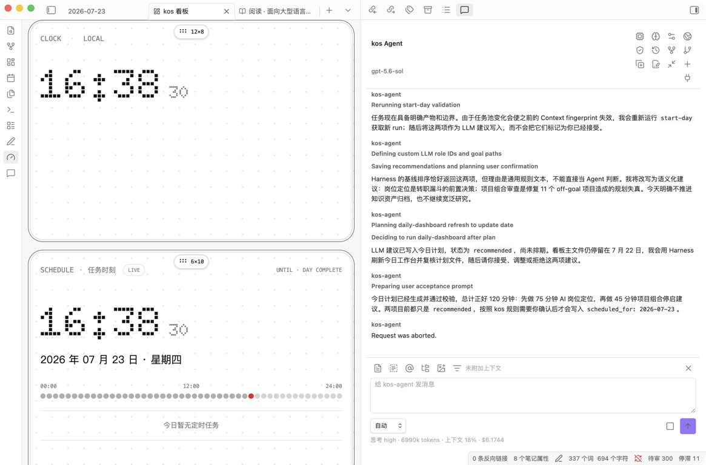

# kos 驾驶舱

kos 驾驶舱是 Vault 的实时工作界面。它不是一份静态 Markdown 报表，也不是自动替用户决策的 AI 首页。

驾驶舱同时承担三种职责：

- 展示可确定计算的 Vault 状态。
- 提供高频直接操作。
- 把需要判断的工作交给 kos-agent，并承载结构化结果。

## 1. 打开驾驶舱

可以通过下面任一入口打开：

- 左侧 Ribbon 的“打开 kos 驾驶舱”。
- 命令面板中的“kos Companion: 打开驾驶舱”。
- 分别运行“打开行动模块”“打开输入模块”“打开知识模块”“打开系统模块”，页面会滚动到对应区块。

驾驶舱是一个连续页面。“今日、行动、输入、知识、审阅与复盘、系统”始终存在于同一页面，不通过 Tab 互相替换。

打开、滚动、筛选和刷新驾驶舱不会自动调用模型。

## 2. 五张工具卡

### 点阵时钟

展示设备本地时间。它不读取 Vault，也不调用模型。

### 当日任务时刻

读取 Task 的 `scheduled_times`，在 48 个半小时点位中呈现当天安排。没有指定时间的今日任务仍会出现在任务视图，但不会进入时间轴。

### H1/H2 目标概览

展示当前周期 active Goal、投入占比、健康度、结果指标和结果证据。active Goal 的权重合计必须为 100。

### 年、月、周、日进度

基于设备本地时间计算，不读取 Vault。进度条每秒刷新，不写入插件数据。

### 365 天活动热力图

根据对象创建、任务完成和日记记录回填历史活动。活动分代表系统内记录，不等于目标贡献或生产力价值。

## 3. 今日

“今日”优先回答下一步行动，而不是展示统计图。

### 确定性事实

包括到期、进行中、阻塞和系统异常。这些信息由 Vault 字段和 Validator 直接计算。

### 需要关注

聚合逾期任务、阻塞任务、停滞 Project、输入积压、待审阅对象和系统错误。

### Agent 建议

点击“开始一天”后，kos-agent 读取 Goal、Project、Task Pool、推迟记录、当日约束和适用的 Capability Focus，形成最多三项建议。

建议必须明确：

- 为什么今天值得做。
- 预计时间。
- 与 Goal 或 Project 的关系。
- 今天明确不做什么。

建议初始状态为 `recommended`。用户可以：

- 接受：写入今日计划。
- 调整：修改时间或内容后再确认。
- 推迟：记录 defer 信息，返回任务池。
- 拒绝：记录反馈，但不删除 Task。

推荐状态与 Task 状态分离。被推荐不等于已经排期，拒绝建议也不等于取消任务。

## 4. 行动

### Project 视图

Project 卡片展示优先级、Goal 对齐、状态、阶段、领域、截止日期、指标、停滞和逾期信息。

直接操作包括：

- 编辑结构化字段。
- 流转状态。
- 让 Agent 分析策略、指标、风险和下一步。
- 打开 Markdown 原文件。

缺少量化过程指标或结果指标的 Project 会显示明确警告。

### Task 视图

支持任务池、今日、进行中、阻塞、已推迟和待归档筛选。常用操作包括：

- 新建或编辑 Task。
- 加入今日计划。
- 推迟或退回 Task Pool。
- 记录阻塞原因和解除条件。
- 完成并记录结果、输出与 Project 贡献。
- 在确认后归档。

复杂的拆解、贡献判断和完成证据应交给 Agent；用户已经明确点击的原子状态操作由 Harness 确定性提交，不需要再次调用模型猜测。

## 5. 输入

“输入”区展示 Source 管道、Inbox 和材料队列。

- “待处理”默认显示尚未完结的 Source。
- “提取重点”打开 Agent 工作流。
- “在 Reader 中阅读”打开独立 Reader。
- 队列状态反映 Source 存量，不应解释为真实转化率。

完整工作流见 `26_输入到知识.md`。

## 6. 知识

“知识”区聚合 Research、Concept 和 Method，并展示成熟度分布。

数量只是资产盘点。大量 draft 可能意味着尚未审阅，也可能意味着历史迁移或批量生成造成的治理债务。判断知识质量时应继续查看来源、个人理解、实际引用和项目使用。

## 7. 审阅与复盘

### 待审阅

待审阅中心聚合 AI 或混合产物。通过前应打开原文件核对来源、证据和正文；“退回 Agent”用于带着反馈继续修改。

需要人工确认的状态包括但不限于：

- Research 的 `reviewed` 和 `complete`。
- Concept 的 `verified` 和 `mature`。
- Personal Operating Profile 的 reviewed / active。
- Goal 的激活、投入占比、结果定义和终态。

### 周期复盘

周报和月报聚合 Goal 投入、Project 指标、Task 流动、推荐反馈和 Capability Focus 证据。复盘可以提出调整建议，但不会自动修改 Goal 或画像。

### 趋势

趋势和成就用于观察活动、知识资产、任务完成、输入管道和系统健康。不要把单一数量指标作为系统效果结论。

## 8. 系统

“系统”区展示：

- Validator 健康分、错误和警告。
- kos-agent 版本、provider、model、Node 和 Web Search 状态。
- Session、上下文用量。
- core、integration、personal、incubator Skill 数量和 Eval 状态。

“重新检查”运行确定性 Validator；“刷新状态”重新读取 Agent 和 Skill 信息。

Validator 失败不一定表示内容不可读，但意味着对象或系统状态不满足当前契约。迁移旧 Vault 时应优先处理 schema、状态和 Project 指标等系统性问题。

## 9. 编辑 Bento 布局

点击“编辑看板布局”后，五张工具卡和六张业务卡都可以：

- 拖动到新的整数格位置。
- 从四边或四角整格缩放。
- 碰撞时将其他卡片向下推移。
- 撤销、重做或恢复默认布局。

业务内容超过当前高度时，卡片按完整行自动增高，不产生卡片内部滚动。布局保存在插件私有 `data.json` 中，不写入 Markdown。

移动端使用单列连续页面，不复用桌面拖动布局。

## 10. 命令面板入口

kos Companion 当前注册的主要命令包括：

- 打开驾驶舱、行动、输入、知识和系统。
- 打开活动热力图、待审核中心和聚合任务。
- 快速捕获到收件箱。
- 新建 Goal、Project、Task、Source、Concept、Method 和 Diary。
- 流转当前文件状态。
- 用 kos Agent 编辑当前选区。
- 使用 kos Reader 打开当前文件。
- 生成本周周报、本月月报。
- 运行系统健康检查。

## 11. 数据与建议必须分离

驾驶舱中应始终区分：

- 确定性事实：从 Vault 和时间直接计算。
- Agent 建议：由 LLM 基于 Context 给出的判断。
- 用户确认：已经接受、调整或拒绝的决定。

普通浏览不触发 Agent；Agent 建议必须标注生成时间；未确认建议不得伪装成用户计划。

## 12. 相关文档

- `25_半年目标与推进.md`
- `23_项目与任务.md`
- `26_输入到知识.md`
- `24_读书与阅读.md`
- `28_Agent协作.md`
- `30_Harness与系统检查.md`
- `90_故障排查.md`
