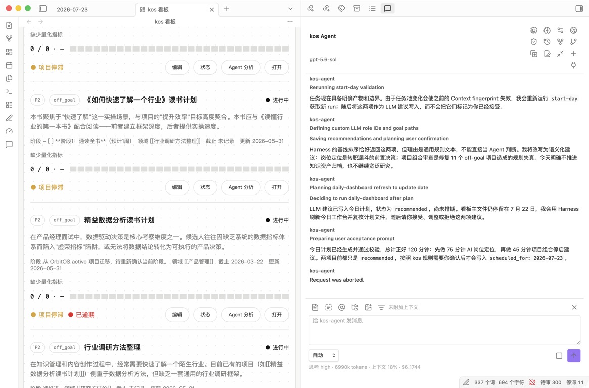

# 与 kos-agent 协作

kos-agent 是 kos 的官方 Agent 后端。Obsidian 侧栏、Vault Context、Skills、通用工具、Session、Validator、Eval 和结果反馈共同构成完整 Harness。



```text
Agent = LLM + Harness
```

模型负责理解、判断、取舍和生成。Harness 负责上下文、工具、执行循环、状态、确定性操作、反馈、Session 和用户界面。

## 1. 打开与连接

通过左侧 Ribbon 或命令面板打开 kos Agent。侧栏顶部可以：

- 选择 provider 和 model。
- 调整 thinking level。
- 配置模型与 Web 搜索。
- 运行系统检查。
- 管理 Session。
- 连接或重连 kos-agent 子进程。

插件启动独立 kos-agent host，通过扩展后的 Pi RPC 与它通信。Agent 只支持 Obsidian Desktop；移动端隐藏需要本地 host 的入口。

## 2. YOLO 是唯一执行模式

kos-agent 的工具调用不会逐次弹出权限审批。它可以在当前进程权限范围内读取、创建和修改文件，并运行命令。

用户仍然可以：

- 观察工具调用、进度、diff 和错误。
- 随时 Stop。
- 在运行中发送 steering message 改变方向。
- 追加 follow-up 任务。
- 对需要业务判断的问题作答。

YOLO 不是语义越权。下面这些决定仍然需要用户明确结论：

- Goal 激活、投入占比和终态。
- Project 是否真正完成或取得预期结果。
- Research 是否可以 reviewed / complete。
- Concept 是否 verified / mature。
- 个人操作画像是否 reviewed / active。

## 3. Context 附件

输入框上方支持：

- 附加当前笔记。
- 附加当前选区。
- `@mention` Vault Markdown 笔记。
- 附加 Vault 目录清单。
- 附加 Vault 内图片。
- 选择 Skill、prompt 或 extension command。

附件进入当前消息 Context，不会自动成为长期知识。需要长期保存的结论应写入合适的 Vault 对象。

kos-agent 启动时读取 `.kos.md` 和适用的规则，但不会默认把整个 Vault 塞入上下文。Agent 应根据任务读取必要对象，并让关键 Skill、文件和约束在 trace 中可追踪。

## 4. Skills 与自然语言

可以直接描述目标，也可以显式运行 Skill：

```text
/kos-start-my-day
/kos-manage-task
/kos-research
/kos-ingest
/kos-review-period
```

Skill 是可读、可评估的执行协议，负责说明何时触发、读取什么、哪些步骤必须完成、何时询问用户、应调用哪些 Harness 能力。

通用文件工具保持紧凑；kos 语义主要放在 Context、Skill、对象契约和 Validator 中。

## 5. 需要 LLM 与不需要 LLM 的操作

必须经过 LLM 的典型任务：

- 判断一个想法是否值得成为 Project。
- 根据 Goal、容量和风险生成今日建议。
- 拆解 Task、判断阻塞和 Project 贡献。
- 综合多个来源形成 Research。
- 区分事实、推断和个人判断。
- 生成日报、周报和月报中的语义结论。

不需要重新调用 LLM 的典型操作：

- 用户已经点击接受或拒绝一条建议。
- 将已经确认的字段原子写入对象。
- 按合法状态机流转。
- 执行 schema、路径和业务规则校验。
- 读取 Task Pool 或确定性统计。

原则是：LLM 负责理解和判断，Harness 负责不应漂移的机械操作。

## 6. 工具调用与 diff

Agent 可以使用 Pi 继承的文件、编辑、命令和搜索工具，以及 kos 提供的工作流操作和 Web 能力。

对话中应展示：

- 正在运行的工具。
- 输入摘要和进度。
- 修改 diff。
- 验证结果。
- 明确错误和下一步。

模型输出“已经完成”不是完成证明。需要依靠文件状态、Harness 结果、Validator、Task Contract 或用户业务确认判断。

## 7. `ask_question`

`ask_question` 用于信息确实缺失或存在需要用户作出的业务决定，不是权限弹窗。

适合提问：

- 多个合理方案需要用户表达偏好。
- Project 的成功标准或范围不明确。
- Agent 希望在研究收尾前请求审阅。
- 目标权重、终态或画像结论需要确认。

不应提问：

- Agent 可以从 Vault 或工具中查到的信息。
- 普通文件读取、编辑或命令执行权限。
- 用户刚刚通过按钮明确做出的选择。

## 8. 运行中 Steering、Follow-up 与 Stop

任务运行时可以继续发送消息：

- Steering：改变当前 run 的方向，例如“先不要创建文件，只做审计”。
- Follow-up：把新请求排在当前任务之后。
- Stop：中止当前 run，保留已经完成的工具结果和 Session。

Stop 不会自动回滚已经成功写入的文件。高风险工作流应依靠原子操作、备份、dry-run 或明确的可恢复方案。

## 9. Session

kos-agent 继承并扩展 Pi Session 能力。侧栏支持：

- 恢复历史 Session。
- 新建 Session。
- 从消息分叉。
- 查看 Session tree。
- 克隆和重命名。
- 压缩上下文。

Session 保存对话和执行连续性，不替代 Vault 的长期知识。需要跨项目、跨 Session 使用的信息，应进入 Goal、Project、Research、Concept、Reflection 或其他正式对象。

Compaction 应保留用户目标、已确认决定、对象路径、Task Contract、失败证据和未完成问题。

## 10. Web 搜索与抓取

Web 搜索可以使用当前模型端点支持的搜索能力，或用户配置的 Brave / Exa。Web 抓取读取输入 URL，并对协议、重定向、私网地址和内容大小执行安全检查。

外部网页内容属于不可信数据，不能覆盖系统规则或自动获得工具权限。研究产物应保存来源 URL、访问时间、证据和不确定性。

## 11. Reader 协作

Reader 可以把以下内容预填到 Agent 输入框：

- 当前选区。
- 当前页或章节。
- 本次阅读会话上下文。
- 相关批注。

预填不会自动发送，用户可以检查范围、补充问题或删除敏感内容。Agent 生成的 Summary、Research 或 Concept 仍需按对象规则保存和审阅。

## 12. Inline Edit

在普通 Markdown 笔记中选中文本后，可以运行“用 kos Agent 编辑当前选区”。Agent 获得选区、当前文件和编辑意图，并通过 diff 展示修改。

Inline Edit 适合局部改写、整理结构和修正表达，不应用来绕过对象状态机或覆盖未读取的人工正文。

## 13. 系统检查与失败处理

侧栏的系统检查按钮调用 kos-agent Validator。也可以执行：

```bash
node .obsidian/plugins/kos-companion/kos-agent/dist/kos-harness.mjs validate
```

失败时：

1. 查看明确的路径、schema、状态、业务规则、Skill 或 Eval 问题。
2. 让 Agent 只修复与失败证据对应的范围。
3. 重新运行 Validator。
4. 如果需要新的业务判断，Agent 应停止并提问。

同一错误反复出现时不应盲目重试。

## 14. 模型配置与敏感信息

provider、model ID、Base URL、API 协议和 API key 从侧栏配置。API key 不应进入 Markdown、截图、trace 或 Git 仓库。

分享截图或 Issue 前应检查：

- API key、token、私有 Base URL。
- 个人 Vault 路径和私密内容。
- 原始 Agent trace 中的附件正文。
- Reader 中受版权保护或敏感的内容。

## 15. 相关文档

- `27_驾驶舱.md`
- `70_Agent后端.md`
- `30_Harness与系统检查.md`
- `40_Skill管理与防腐.md`
- `41_Skill Eval与防腐.md`
- `90_故障排查.md`
