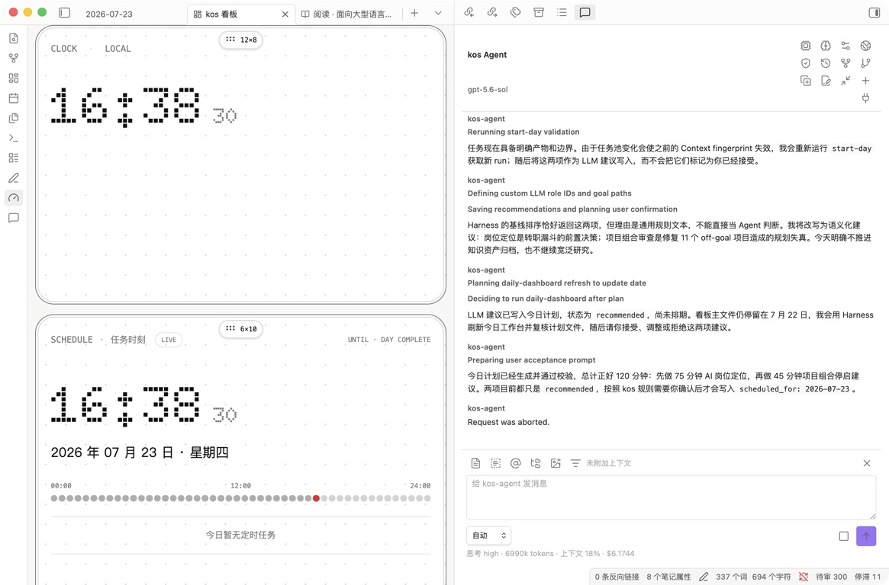

# 日常规划与复盘

kos 的日常循环不是从全部待办中机械挑选最高优先级，而是让 Goal、Project、Task、当日容量和近期反馈形成一条可确认的执行闭环。

```text
开始一天
-> PlanningContext
-> Agent 建议
-> 用户接受 / 调整 / 推迟 / 拒绝
-> Task 执行与结果证据
-> 结束一天
-> 周报 / 月报
-> 待确认的 Goal、Project 或画像调整
```

## 1. 开始一天

可以在驾驶舱点击“开始一天”，或在 kos Agent 中输入：

```text
/kos-start-my-day
```

开始前可以提供：

- 今日可用分钟。
- 当前精力 `low / medium / high`。
- 会议、出行、截止时间等硬约束。
- 今天明确不做的事项。

如果没有提供，Agent 可以使用保守默认值，但必须说明假设。

## 2. PlanningContext 包含什么

Harness 先读取确定性事实，形成 PlanningContext：

- 当前 H1/H2 active Goal 与投入占比。
- 近 28 天估算投入和偏差。
- active、blocked、paused、idea Project。
- Project 指标、里程碑、Goal 支持度和停滞状态。
- 公共 Task Pool、doing、blocked、昨日未完成和推迟记录。
- 当日可用时间、精力和硬约束。
- Validator 异常。
- 当前周期适用的 Capability Focus 摘要。

Harness 可以生成确定性候选，但候选顺序不是最终建议。LLM 仍需比较目标贡献、解锁价值、时间窗口、延迟代价、风险和当日容量。

## 3. Agent 建议

默认最多三项，不需要为了凑数而推荐。



建议通常包含：

- 一项主要 Goal 推进。
- 一项硬承诺、解除阻塞或维护工作。
- 一项可选收尾、探索或能力练习。

每项建议应写清：

- 对应 Task、Project 和 Goal。
- 预计投入。
- 今天为什么值得做。
- 放弃了哪些替代事项。
- 完成的最低证据是什么。

`off_goal` 或 `conflicting` Project 默认不主动推荐。用户已经确认 override 且存在硬承诺时可以纳入，但 Agent 不应每天重复劝阻。

## 4. 建议不是计划

建议初始状态为 `recommended`。只有用户明确反馈后，才形成确认后的今日计划。

| 操作 | 推荐状态 | Task 影响 |
|---|---|---|
| 接受 | `accepted` | 写入 `scheduled_for` 和今日计划 |
| 调整 | `adjusted` | 保存调整后的时间或内容，再排入今日 |
| 推迟 | `deferred` | 写入 `defer_until`，返回 Task Pool |
| 拒绝 | `rejected` | 记录原因，不删除、不取消 Task |

提交反馈是用户已经做出的原子选择，由 Harness 确定性写入，不再让 LLM 重猜一次。

每日计划位于：

```text
00_工作台/计划/YYYY-MM-DD.md
```

它保存 run ID、Context fingerprint、建议和反馈。Context 未变化时可以恢复同一 run；Task、Goal、Project 或约束变化后应创建新 run，不能覆盖旧反馈。

## 5. 今日执行

Task 可以从驾驶舱或 Agent 开始推进。执行过程中应逐步记录：

- 状态：todo、doing、blocked、done。
- 阻塞原因和解除条件。
- 实际产物 `outputs`。
- 完成结果 `result`。
- 对每个关联 Project 的贡献强度和证据。

完成 Task 不能只修改 `status: done`。至少应写明做成了什么；关联 Project 时还要逐个判断 strong、supporting 或 incidental，不能因为存在链接就自动增加项目进度。

Task 完成数量不证明 Goal 取得进展。Goal 需要结果指标、交付物、用户反馈、验证结论或其他明确证据。

## 6. 推迟、退回任务池与阻塞

### 推迟

推迟写入 `defer_until`。在日期到达前，Task 不应继续出现在每日推荐中。

### 退回任务池

已经排入某天但不再承诺当天完成时，可以退回公共 Task Pool。退回不是拒绝或取消。

### 阻塞

阻塞必须记录：

- `blocked_reason`：当前为什么不能继续。
- `unblock_condition`：什么事实发生后可以恢复。

Agent 应分析依赖和下一步，不应只把状态改成 blocked。

## 7. 结束一天

点击驾驶舱“结束一天”，或输入：

```text
/kos-end-my-day
```

LLM 先阅读当天计划、Task 结果、推荐反馈、Project 变化和最近日记，区分：

- 已完成事实。
- 推迟、拒绝和未完成原因。
- Project 贡献证据。
- 需要用户补充的主观感受。
- 可能形成 Reflection 的判断变化。
- 明日继续事项。

Harness 再把结构化事实写入：

```text
40_日记/YYYY/MM/YYYY-MM-DD.md
```

日报保留 `<!-- 人手动添加 -->` 区块。Agent 不能替用户伪造情绪、评价或反思结论。

已完成且关联 Project 的 Task 会成为归档候选，但不会自动移动。用户确认后才进入：

```text
32_任务/归档/<完成年份>/
```

## 8. 周报

```text
/kos-review-period
```

或使用命令“生成本周周报”。周报位于：

```text
41_认知记录/周期复盘/
```

周报重点检查：

- Goal 投入趋势与占比偏差。
- Project 指标、里程碑、阻塞和停滞。
- Task 流入、完成、推迟、拒绝和积压。
- 重复出现的低支持度投入。
- Capability Focus 是否有真实实践证据。

周报可以建议继续、调整、暂停或补证据，但不自动修改 Goal、Project 或画像。

## 9. 月报

月报比周报增加更强的组合判断：

- Goal 健康度是否仍合理。
- 结果定义是否需要调整。
- Project 策略假设是否被证据支持。
- 哪些 Project 应继续、暂停、停止或合并。
- 目标外投入是否需要转为正式 Goal，或明确放弃。
- 个人操作画像是否出现需要复核的反证。

结果定义、Goal 权重、Project 方向和 active 画像的修改都必须等待用户确认。

## 10. Capability Focus

Capability Focus 位于 active Personal Operating Profile，用于表达当前 H1/H2 希望强化的能力。

它只有在 `applies_to` 命中当前工作流时才加载。每日默认最多一项建议显式承担能力练习，不能覆盖截止、阻塞、外部承诺或用户选择。

周报和月报只总结真实实践证据，可以提出画像修订 draft，但不能直接修改 active Profile。

## 11. 恢复中断的每日流程

如果 Agent、Obsidian 或电脑在中途退出：

1. 恢复原 Session。
2. 检查当天 Daily Plan 的 run ID 和推荐状态。
3. 重新运行 `start-day` 取得当前 Context fingerprint。
4. Context 未变化时恢复旧 run；已经变化时创建新 run。
5. 不覆盖旧的接受、推迟或拒绝反馈。

Stop 只中止当前 Agent run，不会回滚已经成功写入的 Task 或计划。

## 12. 常见错误

- 把 Harness 的排序直接标成 Agent 建议。
- Agent 推荐后直接排期，没有等待用户确认。
- 推迟 Task 后第二天仍继续推荐。
- 拒绝建议时删除或取消原 Task。
- Task 完成但没有结果、输出或 Project 贡献证据。
- 用完成数量证明 Goal 成功。
- 日报只运行模板，没有让 LLM 阅读真实执行证据。
- 周月报自动修改 Goal 权重、Project 方向或个人画像。

## 13. CLI 与检查

以下命令是确定性底层接口，适合调试和自动化：

```bash
kos-harness start-day --input '{"availableMinutes":120,"energy":"medium","hardConstraints":[]}'
kos-harness end-day --date YYYY-MM-DD
kos-harness review-week --date YYYY-MM-DD
kos-harness review-month --date YYYY-MM-DD
kos-harness validate
```

日常使用应优先通过 kos Agent 和驾驶舱进入，因为开始一天、结束一天和周期复盘需要 LLM 完成语义判断。

## 14. 相关文档

- `25_半年目标与推进.md`
- `23_项目与任务.md`
- `27_驾驶舱.md`
- `28_Agent协作.md`
- `22_个人操作画像.md`
